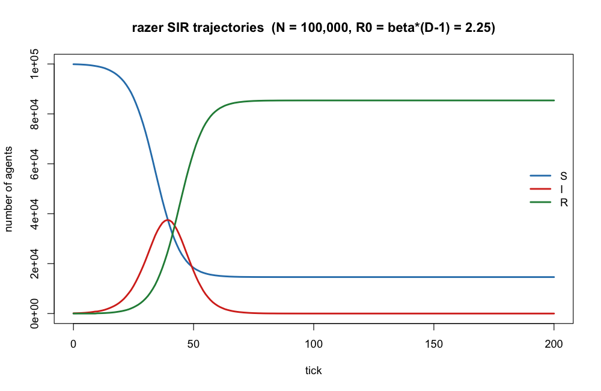
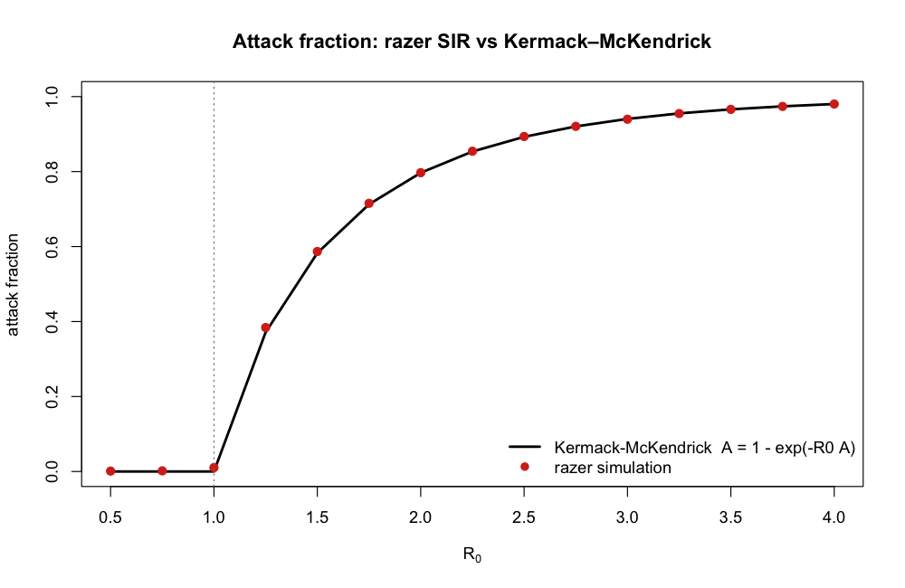
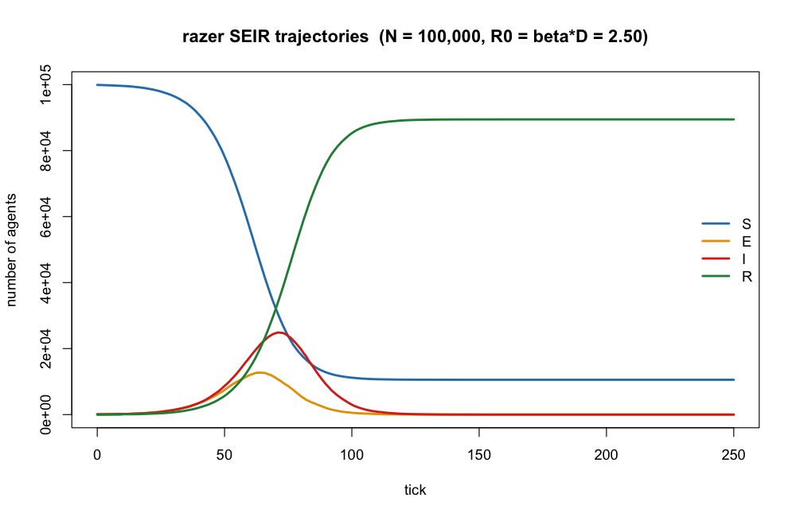
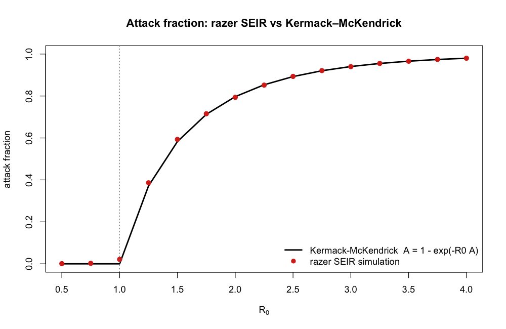

# razer

**R**ust-backed **A**gent modeling with **Z**ero-copy typed arrays for **E**radication **R**esearch

`razer` is an R interface to the [LASER](https://github.com/laser-base) (Light Agent Spatial modeling for ERadication) toolkit. It provides high-performance, Rust-backed data structures and composable kernels for large-scale spatial agent-based disease models. The name is a deliberate pun: "raze" means to eradicate completely, "razor" echoes LASER, and the trailing R anchors it to R.

## Background: the Python LASER project

[LASER](https://github.com/laser-base) is a Python framework developed at the Institute for Disease Modeling for building fast, composable agent-based disease models at national and global scale. Its core design insight is the **struct-of-arrays (SoA)** memory layout: instead of one object per agent, each agent *property* is a flat array, and all active agents are a contiguous slice of that array — cache-friendly for the vectorized, Numba-JIT-compiled kernels that drive LASER's performance.

`razer` ports this memory model to R. Each agent property is a Rust-owned, dtype-tagged array — a `Column` — that R holds only as an opaque external-pointer handle (via the [extendr](https://extendr.github.io/) framework). The per-tick simulation kernels borrow these arrays directly and mutate them in place with no copies, splitting the per-agent work across CPU cores with [Rayon](https://github.com/rayon-rs/rayon). Data crosses back into R only on explicit inspection (`$values()`).

## Requirements

| Tool | Minimum version |
|---|---|
| R | 4.2 |
| Rust / Cargo | 1.65 (installed via `rustup`) |

Install Rust if you don't already have it:

```bash
curl --proto '=https' --tlsv1.2 -sSf https://sh.rustup.rs | sh
```

R package dependencies:

```r
install.packages(c("devtools", "rextendr", "testthat"))
```

## Installation

```r
# From a local clone
devtools::install("/path/to/razer")
```

The first install triggers a full Cargo build; subsequent installs are incremental and much faster.

## Quick start

```r
library(razer)

# Disease-state codes shared by all kernels: c(S = 0, E = 1, I = 2, R = 3, M = 4, D = -1)
states <- laser_states()

# A typed, Rust-owned agent-property array: one million u8 disease states.
state  <- allocate_scalar("u8",  1e6)        # per-agent state (1 byte each)
nodeid <- allocate_scalar("u16", 1e6)        # 0-based patch id per agent
timer  <- allocate_scalar("u8",  1e6)        # state-timer countdown
state$set(rep(states[["S"]], 1e6))           # write the whole buffer
state$values()[1:5]                          # copy a snapshot back to R

# A per-node, per-tick report buffer (n_ticks x n_nodes), stored time-major so each
# tick's per-node row is contiguous. The census is maintained INCREMENTALLY: each tick
# carries column t forward to t+1, then kernels apply only their deltas.
S <- allocate_vector("i32", 365L, 10L)       # 365 ticks x 10 nodes
S$set_col(0L, rep(1e5, 10L))                 # tick 0, per-node susceptibles

# Draw state-timer durations from a parameterized distribution.
inf_period <- dist_gamma(2, 4)               # mean 8 ticks
inf_period$sample_n(5L)
```

Full models compose the per-tick kernels in a loop; see [`examples/`](examples/).

## Architecture

- **`Column`** — a Rust-owned, dtype-tagged array (`i8`/`u8`/`i16`/`u16`/`i32`/`u32`/`f32`/`f64`), allocated as a 1-D per-agent array (`allocate_scalar`) or a 2-D time × node report buffer (`allocate_vector`). `$set()`/`$values()`/`$col()`/`$set_col()` move data to and from R; the kernels operate on the buffer in place. The narrow integer widths (e.g. `u8` state, `u16` node id / timer) keep national-scale populations compact.
- **State codes** — `laser_states()` returns `c(S, E, I, R, M, D)`; `M` is maternal immunity, `D` is deceased (stored as `255` in the `u8` state column).
- **Distributions** — `Distribution` (from `dist_normal()`, `dist_gamma()`, `dist_constant()`, …) supplies per-agent state-timer durations.
- **Per-tick kernels** — `calc_foi` (force of infection, with spatial coupling); the transmission kernels `transmission` (S→E or S→I, sets a u16 timer) and `transmission_si` (S→I absorbing); the three step kernels `step_si` / `step_sir` / `step_sirs` (the timed M→S / E→I / I→{S,R} / R→S transitions of the SI…SEIRS menagerie, each a single u16-timer pass); `carry_forward` / `carry_forward_states` (incremental census) with `move_count` (apply a kernel's returned counts); and the vital-dynamics kernels `births`, `mortality`, `constant_pop_vitals_sir`, `import_infections`. The agent-loop kernels **return per-node counts** and the model applies them to its census — so a model allocates only the compartments it has. All parallelize the per-agent work across cores with private per-node accumulators.
- **Demographics & initialization** — `AliasedDistribution` (`aliased_distribution`) for sampling ages from a pyramid, `KaplanMeierEstimator` (`kaplan_meier_estimator`) for realistic dates of death, `load_pyramid_csv` / `sample_pyramid_ages`, and `calc_capacity` for sizing agent arrays under births.
- **Spatial coupling** — `distances` plus migration-network models (`gravity`, `radiation`, `stouffer`, `competing_destinations`, `row_normalizer`) build the coupling matrix `calc_foi` redistributes the force of infection through.

## Modeling: per-tick ordering and the effective R0

Every model in the SI/SEI/SIS/SEIS/SIR/SEIR/SIRS/SEIRS menagerie is a transmission kernel (`transmission` for S→E or S→I; `transmission_si` for SI's absorbing S→I) plus one step kernel (`step_si`, `step_sir` with the absorbing state parameterized to S or R, or `step_sirs`). Each step kernel leads with M→S, so any model can add a maternal compartment. The one rule to get right is the placement of `calc_foi` so the effective basic reproduction number is the **full `R0 = beta * D`** (never `beta * (D − 1)`):

- **Direct S→I** (SI/SIS/SIR/SIRS): run `calc_foi` *before* the step kernel — `carry_forward_states` → `calc_foi` → `step_*` → `transmission`. A directly-infected agent is not counted on its entry tick, so counting it on its recovery tick instead nets the full `D`.
- **E-entry** (SEI/SEIS/SEIR/SEIRS): agents enter `I` via the step kernel's E→I (run *before* the tally), so run `calc_foi` *after* it — `carry_forward_states` → `step_*` → `calc_foi` → `transmission`.

Each step kernel is a single pass branching on each agent's entry state, so a just-entered timed state is never decremented again the same tick. See `CLAUDE.md` for the full rationale and the per-model table.

## Worked examples

The [`examples/`](examples/) directory has runnable scripts (`Rscript examples/<name>.R`); plots are written to `examples/output/`.

Two validate the simulated **attack fraction** against the **Kermack–McKendrick** final-size relation `A = 1 − exp(−R0·A)`, matching theory to within a few thousandths across the supercritical range — both with `R0 = beta · D`:

**[`sir_attack_fraction.R`](examples/sir_attack_fraction.R) — SIR**




**[`seir_attack_fraction.R`](examples/seir_attack_fraction.R) — SEIR**




The rest build progressively richer models: `simple_sir.R` (spatial SIR over the England & Wales measles patches), `endemic_sir.R` / `endemic_sir_seasonal.R` (endemic and seasonally-forced SIR with vital dynamics and importations), `aged_population.R` (age structure + dates of death), and `engwal_measles.R` (a full M-S-E-I-R measles model with maternal immunity, births, and natural mortality). See [`examples/README.md`](examples/README.md).

## Development

### Repository layout

```
razer/
├── R/
│   ├── extendr-wrappers.R   # auto-generated by rextendr — do not edit
│   ├── values_map.R, carry_states.R, calc_capacity.R, pyramid.R, bincount.R
├── src/
│   └── rust/src/
│       ├── lib.rs           # module registration
│       ├── column.rs        # the Column typed-array store
│       ├── epidemic.rs      # state codes (laser_states)
│       ├── distributions.rs, migration.rs, bincount.rs
│       ├── sir.rs, measles.rs, vitals.rs, mortality.rs, births.rs
│       └── pyramid.rs, kmestimator.rs
├── examples/                # runnable model scripts + output/
├── tests/testthat/
├── man/                     # auto-generated Rd files
└── DESCRIPTION
```

### Building

```r
devtools::document()   # cargo build + regenerate R/extendr-wrappers.R and man/*.Rd
```

For a release (optimised) build:

```bash
REXTENDR_PROFILE=release Rscript -e "devtools::document()"
```

### Running tests

```bash
Rscript -e "devtools::test()"
```

### Modifying the Rust source

1. Edit files under `src/rust/src/`.
2. Quick compile check: `cd src/rust && cargo check`.
3. Regenerate wrappers and rebuild: `devtools::document()` (or `R CMD INSTALL .`).
4. Reload and test: `devtools::test()`.

Rust panics (from `assert!`, `panic!`, or index out-of-bounds) are caught at the extendr C boundary and converted to R `stop()` errors.

## License

MIT — see [LICENSE.md](LICENSE.md).
