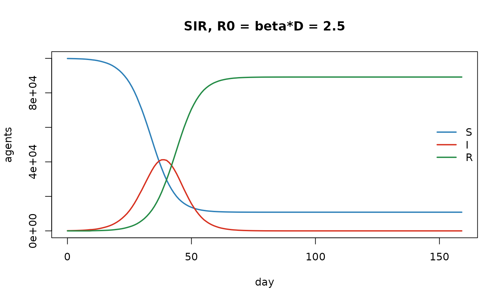
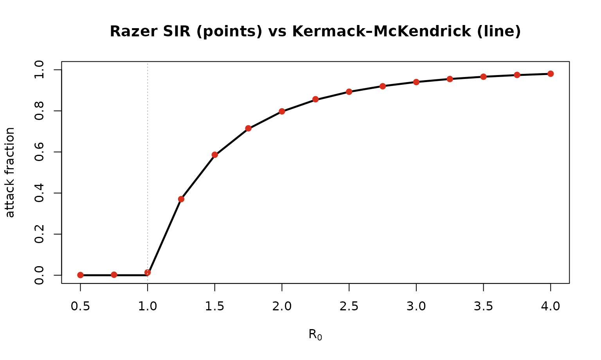
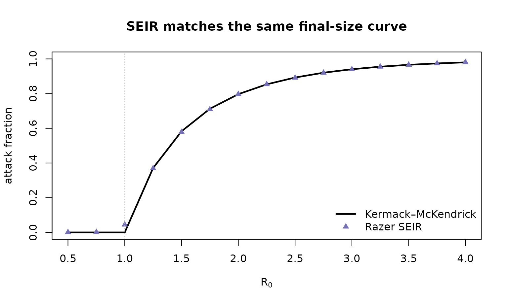

# Epidemic final size: R₀, the attack fraction, and Kermack–McKendrick

> Companion to
> [`examples/sir_attack_fraction.R`](https://github.com/clorton/razer/blob/main/examples/sir_attack_fraction.R)
> and
> [`examples/seir_attack_fraction.R`](https://github.com/clorton/razer/blob/main/examples/seir_attack_fraction.R).
> This notebook is the *why*; those scripts are the runnable reference.

## The model and the question

The textbook **SIR** model splits a population into Susceptible,
Infectious, and Recovered, with mass-action transmission and exponential
recovery:

``` math
\frac{dS}{dt} = -\beta \frac{S I}{N}, \qquad \frac{dI}{dt} = \beta \frac{S I}{N} - \gamma I, \qquad \frac{dR}{dt} = \gamma I,
```

where $`\beta`$ is the transmission rate, $`1/\gamma = D`$ the mean
infectious period, and the **basic reproduction number** is
$`R_0 = \beta D`$ — the expected number of secondary cases from one
infectious individual in a fully susceptible population.

A classic result (Kermack & McKendrick, 1927): a single epidemic in a
closed, well-mixed, fully susceptible population infects a deterministic
**fraction** of the population — the *attack fraction* $`A`$ — given by
the transcendental relation

``` math
\boxed{\,A = 1 - e^{-R_0 A}\,}
```

(For $`R_0 \le 1`$ the only root is $`A=0`$: no epidemic.) The
derivation divides $`dS/dR`$ to get $`S = S_0 e^{-R_0 R/N}`$, then sets
$`t\to\infty`$ with $`I_\infty = 0`$. Notice $`A`$ depends on
$`R_0`$*only* — not on $`\beta`$ and $`D`$ separately, and not on any
latent period. We’ll test all of that against Razer’s stochastic,
agent-based simulation.

## How Razer builds an SIR — and why R₀ = β·D exactly

[`run_model()`](https://clorton.github.io/razer/reference/run_model.md)
advances an **agent-based** SIR: every individual is a row in Rust-owned
`Column` arrays (a `u8` `state`, a `u16` recovery `timer`, a `u16`
`nodeid`). Each tick it runs, in one fixed order,

    carry_forward → step (recover I→R) → calc_foi → transmission (infect S→I)

The subtle part is discrete time. `calc_foi` computes the per-node force
of infection from the **settled** start-of-interval infectious census
$`I[t]`$ (not the half-updated working column), so an agent contributes
to transmission on exactly the $`D`$ ticks it is infectious. That makes
the realized reproduction number the *full* $`R_0 = \beta D`$ — not
$`\beta(D-1)`$, the off-by-one a naive “decrement-then-count” loop would
produce. `run_model` derives $`\beta = R_0 / \overline{D}`$ for us, so
we pass $`R_0`$ directly.

``` r

N <- 1e5L; D <- 10L
m <- run_model(data.frame(population = N, I = 100L), "SIR", nticks = 160L,
               r0 = 2.5, infectious_period = D, seed = 1L)   # beta = 2.5 / 10 = 0.25
traj <- cbind(S = m$nodes$S$values()[, 1], I = m$nodes$I$values()[, 1], R = m$nodes$R$values()[, 1])
matplot(0:159, traj, type = "l", lty = 1, lwd = 2, col = c("#2c7fb8", "#d7301f", "#238b45"),
        xlab = "day", ylab = "agents", main = sprintf("SIR, R0 = beta*D = %.1f", 2.5))
legend("right", c("S", "I", "R"), col = c("#2c7fb8", "#d7301f", "#238b45"), lwd = 2, bty = "n")
```



``` r

cat(sprintf("attack fraction here = 1 - S_inf/N = %.3f  (K-M predicts ~0.89)\n",
            1 - tail(traj[, "S"], 1) / N))
```

    ## attack fraction here = 1 - S_inf/N = 0.892  (K-M predicts ~0.89)

## The final-size test

We sweep $`R_0`$, run each to completion, and read off
$`A = 1 - S_\infty/N`$. (Agent-based `run_model` has no early stop, so
we just use a horizon long enough for the epidemic to finish.) Then we
overlay the Kermack–McKendrick curve.

``` r

km_attack <- function(R0) if (R0 <= 1) 0 else
  uniroot(function(A) 1 - exp(-R0 * A) - A, c(1e-9, 1 - 1e-12))$root

sim_attack <- function(R0, n = 1e5L, D = 10L, horizon = 1500L) {
  mm <- run_model(data.frame(population = n, I = 50L), "SIR", nticks = horizon,
                  r0 = R0, infectious_period = D, seed = 1L)
  S <- mm$nodes$S$values()[, 1]; 1 - S[length(S)] / n
}

R0_grid <- seq(0.5, 4, by = 0.25)
sim <- vapply(R0_grid, sim_attack, numeric(1))
km  <- vapply(R0_grid, km_attack,  numeric(1))

plot(R0_grid, km, type = "l", lwd = 2.5, ylim = c(0, 1),
     xlab = expression(R[0]), ylab = "attack fraction",
     main = "Razer SIR (points) vs Kermack–McKendrick (line)")
points(R0_grid, sim, pch = 19, col = "#d7301f"); abline(v = 1, lty = 3, col = "grey")
```



``` r

cat(sprintf("max |sim - theory| for R0 >= 1.5: %.4f\n", max(abs(sim - km)[R0_grid >= 1.5])))
```

    ## max |sim - theory| for R0 >= 1.5: 0.0035

The agreement is to a few thousandths across the supercritical range — a
strong validation that the agent model realizes $`R_0 = \beta D`$. Just
above threshold ($`R_0 \approx 1`$) the finite seeded population gives a
small positive attack fraction where the *deterministic* theory predicts
zero: expected near-critical, finite-size stochastic behavior.

## SEIR: a latent stage delays but does not change the final size

Adding an Exposed (latent) state —
`run_model(model = "SEIR", incubation_period = …)` — inserts a
non-infectious delay $`S \to E \to I \to R`$. It slows the epidemic’s
*timing* but, because the latent period doesn’t change how many people
one case infects, leaves the final size obeying the *same* relation in
$`R_0 = \beta D`$ (the infectious period alone).

``` r

sim_attack_seir <- function(R0, n = 1e5L, D = 10L, De = 5L, horizon = 2000L) {
  mm <- run_model(data.frame(population = n, I = 50L), "SEIR", nticks = horizon, r0 = R0,
                  infectious_period = D, incubation_period = De, seed = 1L)
  S <- mm$nodes$S$values()[, 1]; 1 - S[length(S)] / n
}
sim_se <- vapply(R0_grid, sim_attack_seir, numeric(1))
plot(R0_grid, km, type = "l", lwd = 2.5, ylim = c(0, 1), xlab = expression(R[0]),
     ylab = "attack fraction", main = "SEIR matches the same final-size curve")
points(R0_grid, sim_se, pch = 17, col = "#7570b3"); abline(v = 1, lty = 3, col = "grey")
legend("bottomright", c("Kermack–McKendrick", "Razer SEIR"), pch = c(NA, 17),
       lwd = c(2.5, NA), col = c("black", "#7570b3"), bty = "n")
```



## Customize and extend

- **Different periods.** `infectious_period` / `incubation_period`
  accept a number (a constant) or any Razer `Distribution`,
  e.g. `dist_gamma(2, 4)` or `dist_normal(7, 1.5)`. Try a fat-tailed
  infectious period and confirm the final size is unchanged (it depends
  on the *mean* via $`R_0`$, not the shape).
- **Reproducibility.** `seed = 1L` threads a seeded RNG through the Rust
  kernels; drop it for entropy-seeded runs, or loop over seeds to get
  confidence bands on the attack fraction near threshold.
- **Beyond one node.** Pass a `network` matrix (an
  $`n_\text{nodes}\times n_\text{nodes}`$ coupling) and a multi-row
  `scenario`; the same final-size logic holds per well-mixed patch (see
  [`examples/simple_sir.R`](https://github.com/clorton/razer/blob/main/examples/simple_sir.R)
  for a 954-patch spatial version).
- **Other structures.** Swap `"SIR"` for any of the eight menagerie
  models, or add waning (`"SIRS"`/`"SEIRS"`, with `immunity_period`) —
  but note waning breaks the single-epidemic assumption, so the
  final-size relation no longer applies (see the [endemic dynamics
  notebook](https://clorton.github.io/razer/articles/endemic_dynamics.md)).
