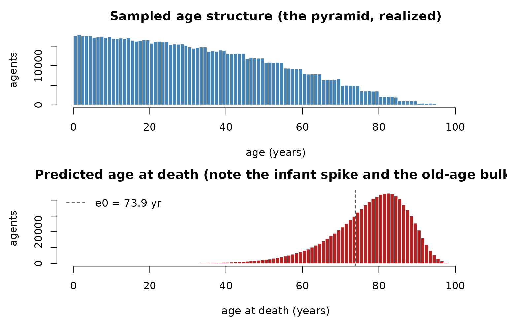

# Realistic populations: age pyramids and dates of death

> Companion to
> [`examples/aged_population.R`](https://github.com/clorton/razer/blob/main/examples/aged_population.R).

## Why bother with demographics?

Many questions need agents that *aren’t* interchangeable: an SIA that
targets under-fives, age-dependent severity, vital dynamics where
newborns enter susceptible and the old die. That requires two
ingredients at initialization — a realistic **age structure**, and a
**date of death** for every agent (so natural mortality can simply
retire agents when their clock arrives). razer provides both, ported
from `laser.core`. No disease here; this is the population-building step
that the vital-dynamics and measles models build on.

## Ages from a population pyramid (the alias method)

A *population pyramid* is the count of people in each age band (often by
sex). To sample a million agents’ ages in proportion to it, razer builds
an **`AliasedDistribution`** — Walker’s alias method, which draws from
an arbitrary discrete distribution in **O(1)** per sample after an O(k)
setup, far faster than a cumulative-sum search.
[`sample_pyramid_ages()`](https://clorton.github.io/razer/reference/sample_pyramid_ages.md)
wraps it: pick a band in proportion to its population, then a uniform
day within that band’s year range, returning ages in **days**.

``` r

pyramid    <- load_pyramid_csv(file.path("..", "..", "examples", "data", "pyramid_example.csv"))  # "Age,M,F" bands
n_agents   <- 1000000L
ages_days  <- sample_pyramid_ages(pyramid, n_agents)
ages_years <- ages_days / 365
cat(sprintf("%s agents; ages %.1f–%.1f yr (mean %.1f)\n",
            format(n_agents, big.mark = ","), min(ages_years), max(ages_years), mean(ages_years)))
```

    ## 1,000,000 agents; ages 0.0–101.0 yr (mean 32.8)

## A date of death (Kaplan–Meier, conditioned on current age)

We want each agent’s *age at death*. razer’s **`KaplanMeierEstimator`**
takes a life table — **cumulative deaths by year** for a synthetic
cohort — and samples an age at death for each agent **conditioned on the
age it is alive at now**, so the draw is never in the past (the essence
of Kaplan–Meier conditional survival). Here we synthesize a life table
from a Gompertz–Makeham per-year mortality hazard $`q(a)`$ — a small
baseline, an exponential rise with age, and an elevated infant rate — by
running a cohort through it.

``` r

n_years <- 106L; age <- 0:(n_years - 1L)
q <- pmin(0.0004 + 1e-5 * exp(0.115 * age), 1); q[1] <- 0.02      # hazard; q[1] = infant mortality
deaths <- numeric(n_years); alive <- 1e5
for (a in seq_len(n_years)) {                                    # run a cohort through the hazard
  d <- if (a == n_years) alive else round(alive * q[a])          # force the last year to clear
  deaths[a] <- d; alive <- alive - d
}
km <- kaplan_meier_estimator(cumsum(deaths))                     # non-decreasing cumulative deaths

death_age_days <- km$predict_age_at_death(ages_days, -1L)        # -1L: use the table's last year
death_age_years <- death_age_days / 365
stopifnot(all(death_age_days >= ages_days))                      # nobody dies in the past
e0 <- mean(km$predict_age_at_death(integer(1e5L), -1L)) / 365    # life expectancy at birth
cat(sprintf("predicted age at death: mean %.1f yr; implied e0 = %.1f yr; mean remaining life %.1f yr\n",
            mean(death_age_years), e0, mean(death_age_years - ages_years)))
```

    ## predicted age at death: mean 77.0 yr; implied e0 = 73.9 yr; mean remaining life 44.2 yr

``` r

par(mfrow = c(2, 1), mar = c(4, 4.5, 2.5, 1)); br <- seq(0, n_years, 1)
hist(ages_years, breaks = br, col = "steelblue", border = "white",
     xlab = "age (years)", ylab = "agents", main = "Sampled age structure (the pyramid, realized)")
hist(death_age_years, breaks = br, col = "firebrick", border = "white",
     xlab = "age at death (years)", ylab = "agents",
     main = "Predicted age at death (note the infant spike and the old-age bulk)")
abline(v = e0, lty = 2, col = "grey30"); legend("topleft", sprintf("e0 = %.1f yr", e0), lty = 2, bty = "n")
```



## How this feeds a model

Store the results as per-agent Columns and the rest of razer can use
them:

- **`dob` (date of birth) = −age in days**, an `i32` Column (negative =
  born before $`t_0`$).
- **`dod` (date of death) = an absolute tick**, a `u32` Column; the
  [`mortality()`](https://clorton.github.io/razer/reference/mortality.md)
  kernel retires an agent when `dod <= tick`. The
  [`births()`](https://clorton.github.io/razer/reference/births.md)
  kernel draws a fresh `dod` for each newborn from the same `km`.
- Age-based **targeting**:
  `bincount_where(nodeid, n_nodes, dob, "gt", tick - 5*365, count)`
  counts (or, with `_wt`, weights) the under-fives per node for a
  campaign or a report.

``` r

dob <- allocate_scalar("i32", n_agents); dob$set(-ages_days)
```

    ## NULL

``` r

dod <- allocate_scalar("u32", n_agents); dod$set(as.integer(death_age_days))
```

    ## NULL

``` r

cat(sprintf("under-5s at t=0: %s of %s agents\n",
            format(sum(dob$values() > -5L * 365L), big.mark = ","), format(n_agents, big.mark = ",")))
```

    ## under-5s at t=0: 88,226 of 1,000,000 agents

## Customize and extend

- **Real pyramids / life tables.** Replace `pyramid_example.csv` with a
  UN/national pyramid, and build `km` from a published abridged life
  table (cumulative deaths by age) instead of the synthetic Gompertz
  hazard.
- **Use it in a model.** Pass these `dob`/`dod` Columns into a
  [`run_model()`](https://clorton.github.io/razer/reference/run_model.md)
  `init` callback and run the `births`/`mortality` kernels in
  `step_exit` — see
  [`examples/engwal_measles.R`](https://github.com/clorton/razer/blob/main/examples/engwal_measles.R)
  and the [vital dynamics
  notebook](https://clorton.github.io/razer/articles/vital_dynamics_measles.md).
- **Sizing the array.** A growing population needs head-room:
  [`calc_capacity()`](https://clorton.github.io/razer/reference/calc_capacity.md)
  bounds the cumulative births,
  [`calc_capacity_cdr()`](https://clorton.github.io/razer/reference/calc_capacity_cdr.md)
  the peak-living size for a
  [`squash()`](https://clorton.github.io/razer/reference/squash.md)-reclaimed
  run (see the [long runs
  notebook](https://clorton.github.io/razer/articles/long_runs_and_memory.md)).
