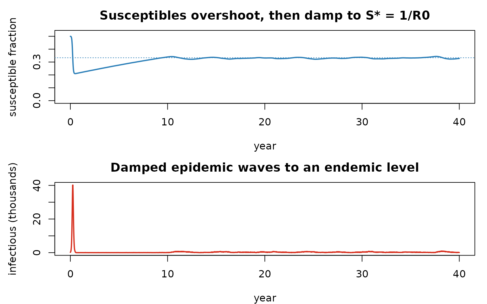
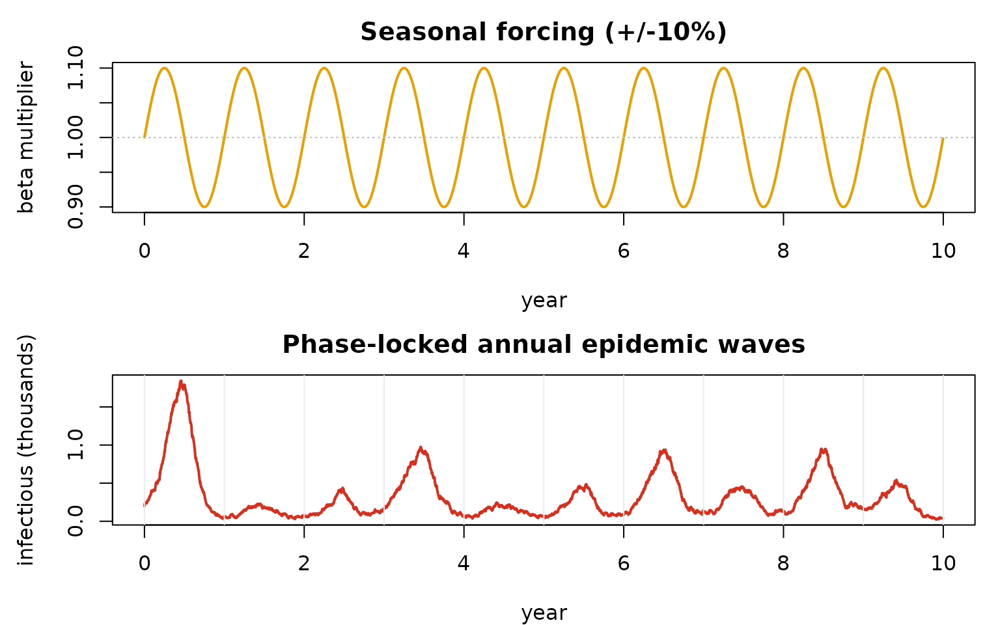

# Endemic dynamics: vital turnover, importation, and seasonality

> Companion to `examples/endemic_sir.R` and
> `examples/endemic_sir_seasonal.R`.

## From a single epidemic to a persistent one

The final-size notebook showed a *closed* SIR burning through its
susceptibles once and stopping. Real endemic diseases persist because
the susceptible pool is continually **replenished** — by births, by loss
of immunity, by migration. Add demographic turnover (birth/death rate
$`\mu`$) to SIR and the system has a non-trivial **endemic
equilibrium**:

``` math
\frac{S^*}{N} = \frac{1}{R_0}, \qquad \frac{I^*}{N} = \frac{\mu}{\beta}\,(R_0 - 1).
```

The susceptible fraction settles at $`1/R_0`$ — the **herd-immunity
threshold** — because that is exactly the level at which the *effective*
reproduction number $`R_\text{eff} = R_0\,S/N`$ equals 1: each case
replaces itself, no more. Push $`S`$ above $`1/R_0`$ and the epidemic
grows; below, it shrinks. The approach to $`S^*`$ is a series of damped
epidemic waves.

## How razer builds it

[`run_model()`](https://clorton.github.io/razer/reference/run_model.md)
itself is **closed-population** (it allocates exactly the initial
agents). Vital dynamics and importation are layered on through its
callbacks and the `capacity` argument:

- **`capacity`** reserves agent slots *above* the initial count, so
  [`import_infections()`](https://clorton.github.io/razer/reference/import_infections.md)
  has somewhere to put newly-introduced cases (a closed run could not
  grow).
- a **`step_exit` callback** runs each tick *after* transmission:
  `constant_pop_vitals_sir` applies births = deaths (each death reborn
  susceptible, so $`N`$ is constant), then `import_infections` seeds a
  few cases on a schedule.

Why importation? A finite stochastic population can have its last
infectious agent recover by chance — *fade-out* — below the **critical
community size**. A trickle of imports keeps the chain alive so we
observe the equilibrium rather than extinction.

First, factor the constant-population vitals + importation into a
reusable pair of callbacks (we use it for both runs below). To watch the
system *approach* the equilibrium rather than land on the answer, we
then seed the population **above** $`S^*`$ — half susceptible, well
above $`1/R_0 \approx 0.33`$ — and let it relax.

``` r

n_nodes <- 2L; pop <- 5e5L; R0 <- 3; cdr <- 20                  # crude death rate (per 1,000/yr)
network <- matrix(c(0, 0.01, 0.01, 0), n_nodes, byrow = TRUE)   # 1% cross-coupling

# init + step_exit for an endemic SIR: constant-population births = deaths (each death reborn
# susceptible, so N is constant) plus a fixed importation schedule that prevents fade-out.
endemic_callbacks <- function(nticks, sched) {
  st <- as.integer(sched$tick); sn <- as.integer(sched$node); sc <- as.integer(sched$count)
  list(
    init = function(model) {
      model$nodes$death_rate   <- values_map(cdr / 1000 / 365, nticks, model$nodes$count)
      model$nodes$births       <- allocate_vector("i32", nticks - 1L, model$nodes$count)
      model$nodes$deaths       <- allocate_vector("i32", nticks - 1L, model$nodes$count)
      model$nodes$importations <- allocate_vector("i32", nticks - 1L, model$nodes$count)
    },
    step_exit = function(model) {
      constant_pop_vitals_sir(model$people$state, model$people$timer, model$people$nodeid,
        model$people$count, model$nodes$death_rate, model$nodes$S, model$nodes$I,
        model$nodes$R, model$nodes$births, model$nodes$deaths, model$tick)
      model$people$count <- import_infections(model$people$state, model$people$timer,
        model$people$nodeid, model$people$count, model$nodes$I, model$nodes$importations,
        st, sn, sc, dist_gamma(2, 4), model$tick)
    })
}
```

``` r

nticks   <- 40L * 365L                                              # long enough to settle
sched    <- expand.grid(tick = seq(0L, nticks - 2L, 30L), node = 0:1); sched$count <- 5L
# Seed ABOVE the equilibrium: half the population susceptible (R = N/2 immune), so S0 = 0.5 > 1/R0.
scenario <- data.frame(population = rep(pop, n_nodes), I = rep(100L, n_nodes),
                       R = rep(round(0.5 * pop), n_nodes))
cb <- endemic_callbacks(nticks, sched)
m <- run_model(scenario, "SIR", nticks = nticks, r0 = R0, infectious_period = dist_gamma(2, 4),
               network = network, capacity = sum(scenario$population) + sum(sched$count),
               seed = 1L, init = cb$init, step_exit = cb$step_exit)

yr <- (seq_len(nticks) - 1L) / 365
S  <- rowSums(m$nodes$S$values()) / (n_nodes * pop)                 # susceptible FRACTION
I  <- rowSums(m$nodes$I$values())
par(mfrow = c(2, 1), mar = c(4, 4.5, 2.5, 1))
plot(yr, S, type = "l", lwd = 2, col = "#2c7fb8", ylim = c(0, max(S) * 1.05),
     xlab = "year", ylab = "susceptible fraction", main = "Susceptibles overshoot, then damp to S* = 1/R0")
abline(h = 1 / R0, lty = 3, col = "#2c7fb8")                        # the equilibrium S*/N = 1/R0
plot(yr, I / 1e3, type = "l", lwd = 2, col = "#d7301f",
     xlab = "year", ylab = "infectious (thousands)", main = "Damped epidemic waves to an endemic level")
```



Starting at $`S/N = 0.5`$, the first epidemic *overshoots* — driving
susceptibles well below $`1/R_0`$ — then births refill the pool, a
smaller epidemic fires, and the system **spirals in** to $`S^* = N/R_0`$
(dotted line) through damped waves, persisting at a low endemic level
instead of going extinct. (Seed it *at* $`1/R_0`$ and the line is flat
from tick 0 — the system is already at rest, which is what
`endemic_sir.R` does to study the equilibrium and its seasonal response
directly.)

## Seasonal forcing: a small wobble, a big response

Make transmission seasonal by passing `run_model` a time-varying
`seasonality` multiplier (any `values_map`-broadcastable shape). Because
the endemic system sits **critically poised** at
$`R_\text{eff}\approx 1`$, even a gentle annual sinusoid ($`\pm 10\%`$
on $`\beta`$) drives pronounced, phase-locked **annual epidemic waves**
— a resonance phenomenon central to the dynamics of childhood infections
like measles. Here we seed *at* the equilibrium so the forced waves
stand out without a startup transient.

``` r

nticks   <- 10L * 365L
sched    <- expand.grid(tick = seq(0L, nticks - 2L, 30L), node = 0:1); sched$count <- 10L
scenario <- data.frame(population = rep(pop, n_nodes), I = rep(100L, n_nodes),
                       R = rep(pop - round(pop / R0), n_nodes))      # seed S = N/R0 (at equilibrium)
amp  <- 0.10
seas <- 1 + amp * sin(2 * pi * (seq_len(nticks) - 1L) / 365)        # length-nticks per-day multiplier
cb <- endemic_callbacks(nticks, sched)
ms <- run_model(scenario, "SIR", nticks = nticks, r0 = R0, infectious_period = dist_gamma(2, 4),
                network = network, seasonality = seas,
                capacity = sum(scenario$population) + sum(sched$count),
                seed = 1L, init = cb$init, step_exit = cb$step_exit)
yr <- (seq_len(nticks) - 1L) / 365
par(mfrow = c(2, 1), mar = c(4, 4.5, 2.5, 1))
plot(yr, seas, type = "l", lwd = 2, col = "#e6a000", xlab = "year", ylab = "beta multiplier",
     main = sprintf("Seasonal forcing (+/-%.0f%%)", 100 * amp)); abline(h = 1, lty = 3, col = "grey")
plot(yr, rowSums(ms$nodes$I$values()) / 1e3, type = "l", lwd = 2, col = "#d7301f",
     xlab = "year", ylab = "infectious (thousands)", main = "Phase-locked annual epidemic waves")
abline(v = 0:10, col = "grey92")
```



## Customize and extend

- **Mortality / turnover.** Raise `cdr` (here 20/1000/yr) to replenish
  susceptibles faster — larger $`\mu`$ raises the endemic $`I^*`$ and
  shortens the inter-epidemic period.
- **Importation.** Edit the `sched` data frame (which ticks, which
  nodes, how many) — set it to zero and watch a small population fade
  out (cross the critical community size).
- **Forcing.** Change `amp`, or replace the sinusoid with school-term
  square waves; try the $`R_0`$ that makes the inter-epidemic period
  resonate with the annual drive.
- **Growing populations.** For true births (population growth, newborns
  into a maternal `M` state) rather than constant-population turnover,
  see `examples/engwal_measles.R` and the interventions notebook —
  `run_model(extra_states = "M", capacity = …)` plus the `births` /
  `mortality` kernels.
- **Space.** Add patches to `scenario` and entries to `network` to study
  spatial coupling, travelling waves, and metapopulation persistence.
