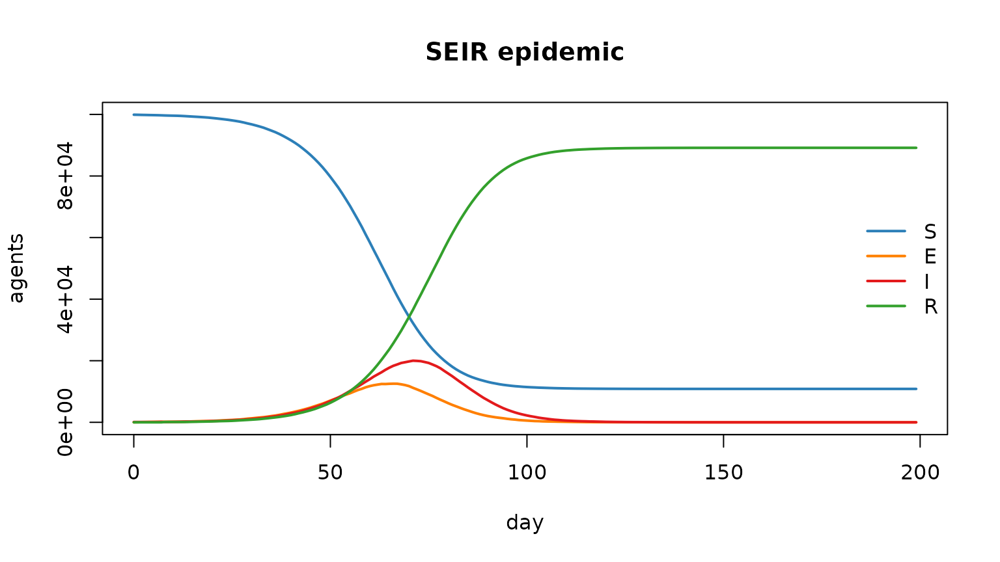
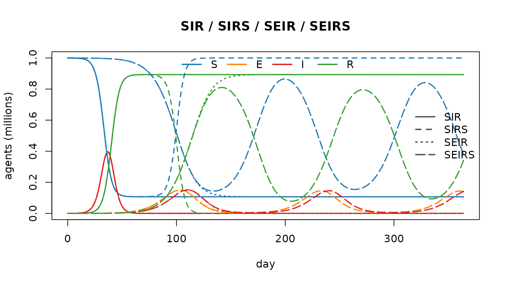
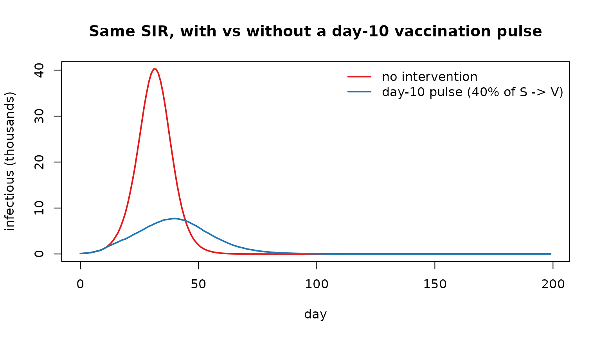

# razer — getting started (R Notebook)

This is an **R Notebook** — R’s equivalent of a Jupyter notebook. In
RStudio, click *Run* on a chunk (or press *Ctrl/Cmd+Shift+Enter*) and
the output — including plots — appears inline beneath it; *Preview*
renders the whole thing to HTML. The `.R` scripts in `examples/` are the
same models as standalone scripts; this notebook shows the interactive
workflow.

``` r

library(razer)
states <- laser_states()   # c(S = 0, E = 1, I = 2, R = 3, M = 4, D = -1)
```

## 1. Run a model

[`run_model()`](https://clorton.github.io/razer/reference/run_model.md)
builds an agent population from a per-node `scenario`, advances one of
the SI / SEI / SIS / SEIS / SIR / SEIR / SIRS / SEIRS models, and
returns a **`model` environment** with the per-node census Columns.
Here: a single well-mixed SEIR epidemic.

``` r

scenario <- data.frame(population = 1e5L, I = 100L)
m <- run_model(scenario, "SEIR", nticks = 200L, r0 = 2.5,
               infectious_period = 8, incubation_period = 5, seed = 1L)

# $values() copies a census Column back as an (nticks x n_nodes) matrix; [, 1] is the node.
traj <- cbind(S = m$nodes$S$values()[, 1], E = m$nodes$E$values()[, 1],
              I = m$nodes$I$values()[, 1], R = m$nodes$R$values()[, 1])
matplot(0:199, traj, type = "l", lty = 1, lwd = 2,
        col = c("#2c7fb8", "#ff7f00", "#e31a1c", "#33a02c"),
        xlab = "day", ylab = "agents", main = "SEIR epidemic")
legend("right", c("S", "E", "I", "R"), col = c("#2c7fb8", "#ff7f00", "#e31a1c", "#33a02c"),
       lwd = 2, bty = "n")
```



## 2. Compare state structures

Run four models on the *same* population and parameters; colour by
state, line type by model (this is `examples/compare_models.R`,
condensed).

``` r

N <- 1e6L; nticks <- 365L; D <- dist_gamma(140, 0.05)   # mean 7-day periods
runs <- lapply(c("SIR", "SIRS", "SEIR", "SEIRS"), function(mod) {
  args <- list(scenario = data.frame(population = N, I = 100L), model = mod,
               nticks = nticks, r0 = 2.5, infectious_period = D, seed = 1L)
  if (grepl("E", mod))            args$incubation_period <- D
  if (mod %in% c("SIRS", "SEIRS")) args$immunity_period  <- 60
  do.call(run_model, args)
})
names(runs) <- c("SIR", "SIRS", "SEIR", "SEIRS")

col_comp  <- c(S = "#1f78b4", E = "#ff7f00", I = "#e31a1c", R = "#33a02c")
lty_model <- c(SIR = 1, SIRS = 2, SEIR = 3, SEIRS = 5)
plot(NA, xlim = c(0, nticks - 1), ylim = c(0, 1), xlab = "day", ylab = "agents (millions)",
     main = "SIR / SIRS / SEIR / SEIRS")
for (mod in names(runs)) for (cmp in c("S", "E", "I", "R")) {
  col <- runs[[mod]]$nodes[[cmp]]
  if (!is.null(col)) lines(0:(nticks - 1), rowSums(col$values()) / 1e6,
                           col = col_comp[cmp], lty = lty_model[mod], lwd = 1.8)
}
legend("top", names(col_comp), col = col_comp, lwd = 2, lty = 1, horiz = TRUE, bty = "n")
legend("right", names(lty_model), col = "grey30", lwd = 2, lty = lty_model, bty = "n")
```



## 3. Add an intervention with a callback

[`run_model()`](https://clorton.github.io/razer/reference/run_model.md)
takes `init` / `step_enter` / `step_update` / `step_exit` callbacks and
an `extra_states` argument for user-defined states. Here a one-off
vaccination moves 40% of the still-susceptible population to a new `"V"`
state on day 10 — early, *before* the wave takes off — so it has
something to prevent (see `examples/sia_campaigns.R` and
`examples/quarantine.R` for scheduled / leaky versions). We compare the
*same* SIR model with and without that pulse, so the difference is the
intervention alone.

``` r

sir_args <- list(scenario, "SIR", nticks = 200L, r0 = 2.5, infectious_period = 8, seed = 1L)
base <- do.call(run_model, sir_args)                       # no intervention
vacc <- do.call(run_model, c(sir_args, list(extra_states = "V",
                  step_exit = function(model) {
                    if (model$tick != 10L) return(invisible())
                    V <- model$states[["V"]]; S <- model$states[["S"]]
                    s <- model$people$state$values()
                    take <- which(s == S); take <- take[runif(length(take)) < 0.4]
                    s[take] <- V; model$people$state$set(s)
                    move_count(model$nodes$S, model$nodes$V, length(take), model$tick)
                  })))
matplot(0:199, cbind(`no intervention` = rowSums(base$nodes$I$values()),
                     vaccinated = rowSums(vacc$nodes$I$values())) / 1e3,
        type = "l", lty = 1, lwd = 2, col = c("#e31a1c", "#1f78b4"),
        xlab = "day", ylab = "infectious (thousands)",
        main = "Same SIR, with vs without a day-10 vaccination pulse")
legend("topright", c("no intervention", "day-10 pulse (40% of S -> V)"),
       col = c("#e31a1c", "#1f78b4"), lwd = 2, bty = "n")
```



## Where to next

The `examples/` directory has runnable `.R` scripts for every model and
intervention (spatial SIR, endemic dynamics, measles with vital
dynamics + maternal immunity, SIA campaigns with/without waning,
quarantine, a 100-year squash run, …). Each prints a summary and, when
sourced in RStudio, draws its plots in the **Plots** pane; run via
`Rscript` it writes the same figures to `examples/output/`.
