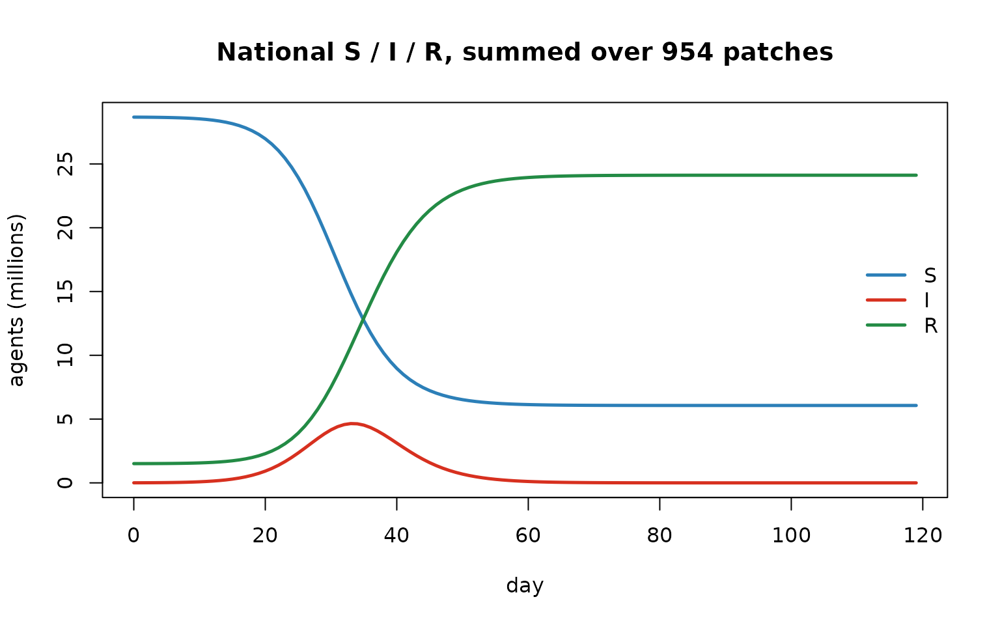
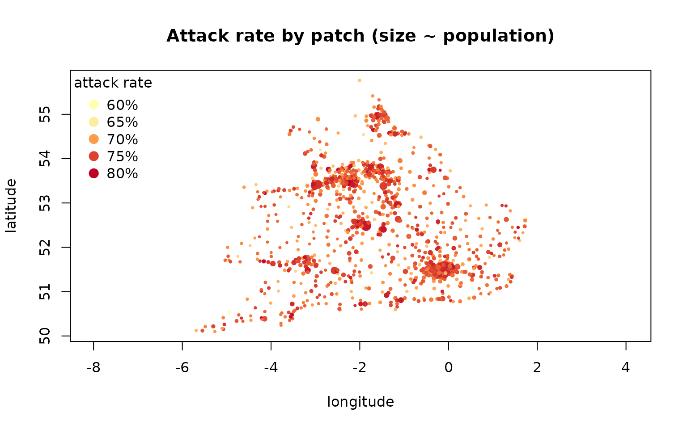

# Spatial epidemics: metapopulations and migration networks

> Companion to
> [`examples/simple_sir.R`](https://github.com/clorton/razer/blob/main/examples/simple_sir.R).

## Why space?

A single well-mixed population is a useful fiction, but real epidemics
play out across a **metapopulation** — a set of patches (towns,
districts, countries) each with its own local transmission, *coupled* by
the movement of people. Coupling drives the phenomena a single-patch
model can’t show: spatial **invasion waves**, **rescue** of a faded-out
patch by its neighbours, and partial **synchrony** between patches.

Razer models a metapopulation as $`n`$ patches each running the usual
SIR transmission, plus a coupling matrix $`W`$ where $`W_{ij}`$ is the
fraction of patch $`i`$’s force of infection that is *exported* to patch
$`j`$. The kernel `calc_foi` redistributes each tick:

``` math
\lambda_k \;=\; r_k\Big(1 - \textstyle\sum_j W_{kj}\Big) \;+\; \sum_i r_i\,W_{ik}, \qquad r_k = \beta_k\,\frac{I_k}{N_k},
```

i.e. patch $`k`$ keeps the un-exported part of its own local force and
imports a share of every other patch’s.

## Building a coupling network

We use the England & Wales measles patches (954 registration districts,
each with a 1944 population and a latitude/longitude). Razer ships
several **migration models** that turn pairwise distances + populations
into a weight matrix —
[`gravity()`](https://clorton.github.io/razer/reference/gravity.md),
[`radiation()`](https://clorton.github.io/razer/reference/radiation.md),
[`stouffer()`](https://clorton.github.io/razer/reference/stouffer.md),
[`competing_destinations()`](https://clorton.github.io/razer/reference/competing_destinations.md)
— plus
[`row_normalizer()`](https://clorton.github.io/razer/reference/row_normalizer.md)
to cap each patch’s total emigration so the rows are valid export
fractions. Here: the parameter-free **radiation model** (Simini et al.,
*Nature* 2012), capped at 10% emigration per patch.

``` r

# A pkgdown article under vignettes/articles/, so the shared example data is two up.
scenario <- read.csv(file.path("..", "..", "examples", "data", "EnglandWalesMeasles_places.csv"))
D  <- distances(scenario$latitude, scenario$longitude)            # pairwise great-circle km
W  <- radiation(scenario$population, D, k = 1, include_home = FALSE)
W  <- row_normalizer(W, max_rowsum = 0.1)                         # cap total emigration at 10%
cat(sprintf("%d patches; total population %s; network row-sums in [%.3f, %.3f]\n",
            nrow(scenario), format(sum(scenario$population), big.mark = ","),
            min(rowSums(W)), max(rowSums(W))))
```

    ## 954 patches; total population 30,182,538; network row-sums in [0.009, 0.100]

## Run a spatial SIR

[`run_model()`](https://clorton.github.io/razer/reference/run_model.md)
takes the coupling matrix directly as `network`; internally it is stored
once as a 2-D Column so `calc_foi` reads it Rust-side each tick. We seed
a few infectious and ~5% immune in every patch and run a daily SIR for
~4 months.

``` r

scenario$I <- pmin(5L, scenario$population)                       # 5 infectious / patch
scenario$R <- pmin(as.integer(0.05 * scenario$population), scenario$population - scenario$I)
m <- run_model(scenario, "SIR", nticks = 120L, beta = 2 / 4,   # R0 = beta * mean(gamma(2,2) = 4) = 2
               infectious_period = dist_gamma(2, 2), network = W, seed = 1L)

days <- 0:119
S <- rowSums(m$nodes$S$values()); I <- rowSums(m$nodes$I$values()); R <- rowSums(m$nodes$R$values())
matplot(days, cbind(S, I, R) / 1e6, type = "l", lty = 1, lwd = 2.5,
        col = c("#2c7fb8", "#d7301f", "#238b45"), xlab = "day", ylab = "agents (millions)",
        main = "National S / I / R, summed over 954 patches")
legend("right", c("S", "I", "R"), col = c("#2c7fb8", "#d7301f", "#238b45"), lwd = 2.5, bty = "n")
```



## Map the burden

Because the model is spatial, the interesting output is *per patch*.
Each patch’s census is its own column of `m$nodes$I$values()`; here we
map the **attack rate** (fraction ever infected) at each patch’s
coordinates, sized by population — the recognizable shape of England &
Wales.

``` r

attack <- colSums(m$nodes$incidence$values()) / scenario$population   # per-patch fraction infected
pal <- grDevices::colorRampPalette(c("#ffffb2", "#fd8d3c", "#bd0026"))(64)
rng <- range(attack); idx <- pmax(1L, pmin(64L, 1L + round(63 * (attack - rng[1]) / max(diff(rng), 1e-9))))
plot(scenario$longitude, scenario$latitude, pch = 19, asp = 1, col = pal[idx],
     cex = 0.3 + 1.8 * sqrt(scenario$population / max(scenario$population)),
     xlab = "longitude", ylab = "latitude", main = "Attack rate by patch (size ~ population)")
lv <- pretty(rng, 4)
legend("topleft", title = "attack rate", bty = "n", pch = 19, pt.cex = 1.4,
       legend = sprintf("%.0f%%", 100 * lv),
       col = pal[pmax(1L, pmin(64L, 1L + round(63 * (lv - rng[1]) / max(diff(rng), 1e-9))))])
```



## Customize and extend

- **Migration model.** Swap
  [`radiation()`](https://clorton.github.io/razer/reference/radiation.md)
  for `gravity(population, D, ...)` (tunable distance decay) or
  [`stouffer()`](https://clorton.github.io/razer/reference/stouffer.md)
  /
  [`competing_destinations()`](https://clorton.github.io/razer/reference/competing_destinations.md);
  tighten/loosen `row_normalizer(max_rowsum = …)` to change how strongly
  patches couple.
- **Watch an invasion wave.** Seed a *single* patch (e.g. the largest)
  with `I` and set `R = 0` everywhere, then map the per-patch *day of
  peak* (`apply(I_mat, 2, which.max)`): patches light up later the
  farther they sit from the seed, along the network.
- **Endemic + spatial.** Add the constant-population vitals `step_exit`
  callback from the endemic notebook (and a `capacity` for imports) to
  keep patches endemic and study spatial persistence / rescue effects
  below the critical community size.
- **Seasonality per patch.** `run_model`’s `seasonality` accepts a full
  `n_ticks x n_nodes` grid (via `values_map`), so different patches can
  have offset school terms or climates.
