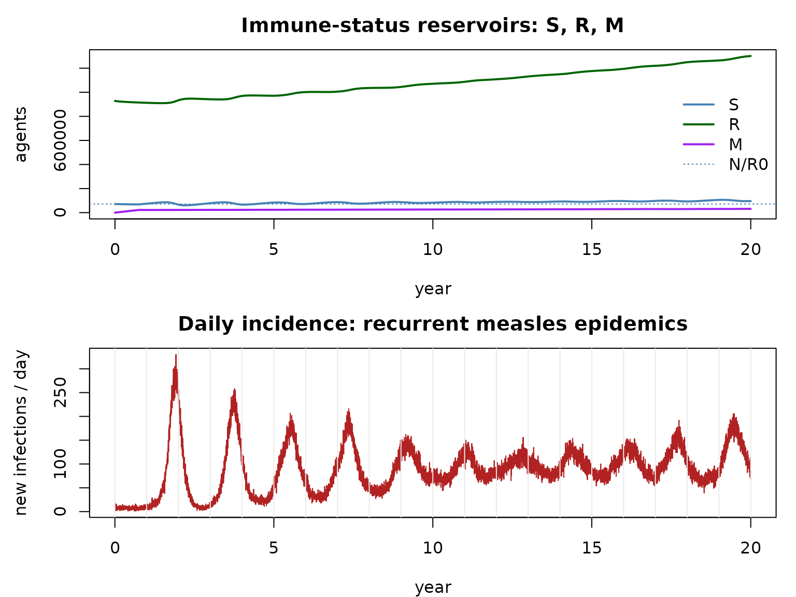

# Vital dynamics and maternal immunity: a measles model

> Companion to `examples/engwal_measles.R`. Builds on the demographics
> and endemic notebooks.

## Measles: why a richer model

Measles is the canonical childhood infection: very transmissible
($`R_0 \approx 12`$–$`18`$), fully immunizing, and — crucially —
sustained by the **birth of new susceptibles**. Modelling it well needs
more than SIR:

- **M** — *maternal immunity*: newborns are temporarily protected by
  maternal antibodies, then wane to **S** after ~9 months. So the
  disease chain is **M → S → E → I → R**.
- **vital dynamics**: a crude birth rate feeds newborns into **M**, and
  every agent has a realistic age and a date of death so **natural
  mortality** retires it on schedule.

The susceptible supply (births) makes the system endemic, with the
damped/forced **recurrent epidemics** familiar from pre-vaccination
measles.

## How razer assembles it

This is where razer’s extensibility pays off — no kernel changes, just
[`run_model()`](https://clorton.github.io/razer/reference/run_model.md)
knobs:

- **`extra_states = "M"`** registers the maternal state. The disease
  kernels lead with the M→S waning leg, so `run_model` applies it for us
  each tick (recording the `waning_m` flow).
- **`capacity`** (from
  [`calc_capacity()`](https://clorton.github.io/razer/reference/calc_capacity.md))
  reserves slots for the population to grow into over the 20-year run;
  the `births` kernel activates them.
- an **`init` callback** gives each agent an age (from a pyramid-like
  curve) and a Kaplan–Meier date of death (see the demographics
  notebook).
- a **`step_exit` callback** runs `births` (newborns into M, with a
  maternal timer + a KM date of death) and `mortality` (retire agents
  whose `dod` has arrived) each tick.

``` r

# A survivorship curve l(a) from a Gompertz–Makeham hazard; its complement (cumulative
# deaths) is the life table, and l(a) itself is the initial age distribution. Deriving both
# from one curve keeps the age structure and mortality mutually consistent.
max_age <- 100L; ay <- 0:max_age
haz <- pmin(0.0004 + 1e-5 * exp(0.115 * ay), 1); haz[1] <- 0.02
surv <- numeric(max_age + 2L); surv[1] <- 1
for (a in seq_len(max_age + 1L)) surv[a + 1L] <- surv[a] * (1 - haz[a])
surv[max_age + 2L] <- 0
cohort <- 1e6
age_dist <- aliased_distribution(round(surv[1:(max_age + 1L)] * cohort))      # initial ages
km       <- kaplan_meier_estimator(round((surv[1] - surv[2:(max_age + 2L)]) * cohort))  # life table
```

``` r

r0 <- 14; cbr <- 30; nticks <- 20L * 365L; pop <- 1000000L
inf_dur <- dist_normal(7, 1.5); inc_dur <- dist_normal(7, 1.5)     # infectious / latent (days)
mat_dur <- dist_normal(270, 20)                                   # maternal-immunity waning (~9 mo)
capacity <- as.integer(calc_capacity(matrix(cbr, nticks - 1L, 1L), pop, safety_factor = 1))

# Seed near the herd-immunity threshold: immune fraction 1 - 1/R0, a small infectious spark.
scenario <- data.frame(population = pop, R = round((1 - 1 / r0) * pop), I = 100L)

m <- run_model(scenario, "SEIR", nticks = nticks, r0 = r0, infectious_period = inf_dur,
               incubation_period = inc_dur, capacity = capacity, extra_states = "M",
               seed = 1L, progress = FALSE,
               init = function(model) {
                 cap <- model$people$capacity
                 model$people$dob <- allocate_scalar("i32", cap)
                 model$people$dod <- allocate_scalar("u32", cap)
                 model$nodes$birth_rate <- values_map(cbr / 1000 / 365, nticks, 1L)
                 model$nodes$births     <- allocate_vector("i32", nticks - 1L, 1L)
                 model$nodes$deaths     <- allocate_vector("i32", nticks - 1L, 1L)
                 age_days <- age_dist$sample_n(pop) * 365L + as.integer(floor(stats::runif(pop) * 365))
                 model$people$dob$set(c(-age_days, integer(cap - pop)))
                 model$people$dod$set(c(as.integer(km$predict_age_at_death(age_days, -1L) - age_days),
                                        integer(cap - pop)))
               },
               step_exit = function(model) {
                 t <- model$tick
                 b <- births(model$people$state, model$people$timer, model$people$nodeid,
                             model$people$dob, model$people$dod, model$people$count, 1L,
                             model$nodes$birth_rate, mat_dur, km, t)
                 model$people$count <- b$count
                 move_count(NULL, model$nodes$M, b$born, t); model$nodes$births$set_col(t, b$born)
                 d <- mortality(model$people$state, model$people$dod, model$people$nodeid,
                                model$people$count, 1L, t)
                 move_count(model$nodes$M, NULL, d$m, t); move_count(model$nodes$S, NULL, d$s, t)
                 move_count(model$nodes$E, NULL, d$e, t); move_count(model$nodes$I, NULL, d$i, t)
                 move_count(model$nodes$R, NULL, d$r, t); model$nodes$deaths$set_col(t, d$m+d$s+d$e+d$i+d$r)
               })
cat(sprintf("living %s -> %s over 20 yr; cases %s; births %s; deaths %s\n",
            format(pop, big.mark = ","),
            format(round(sum(sapply(c("M","S","E","I","R"), function(s) m$nodes[[s]]$values()[nticks, ]))), big.mark = ","),
            format(sum(m$nodes$incidence$values()), big.mark = ","),
            format(sum(m$nodes$births$values()), big.mark = ","),
            format(sum(m$nodes$deaths$values()), big.mark = ",")))
```

    ## living 1,000,000 -> 1,430,070 over 20 yr; cases 641,290; births 715,584; deaths 285,514

``` r

yr <- (seq_len(nticks) - 1L) / 365
S <- rowSums(m$nodes$S$values()); R <- rowSums(m$nodes$R$values()); M <- rowSums(m$nodes$M$values())
par(mfrow = c(2, 1), mar = c(4, 4.5, 2.5, 1))
matplot(yr, cbind(S, R, M), type = "l", lty = 1, lwd = 2, col = c("steelblue", "darkgreen", "purple"),
        xlab = "year", ylab = "agents", main = "Immune-status reservoirs: S, R, M")
abline(h = pop / r0, lty = 3, col = "steelblue")                 # S* = N / R0
legend("right", c("S", "R", "M", "N/R0"), col = c("steelblue", "darkgreen", "purple", "steelblue"),
       lwd = c(2, 2, 2, 1), lty = c(1, 1, 1, 3), bty = "n")
plot(yr[-1], rowSums(m$nodes$incidence$values()), type = "l", col = "firebrick",
     xlab = "year", ylab = "new infections / day", main = "Daily incidence: recurrent measles epidemics")
abline(v = 0:20, col = "grey92")
```



Susceptibles hover near the herd-immunity threshold $`N/R_0`$ (the small
`1/14 ≈ 7%` reservoir that births top up), `M` is a thin layer of
protected newborns, and incidence breaks into **recurrent epidemics** as
the birth-fed susceptible pool repeatedly crosses threshold.

## Customize and extend

- **Vaccination.** Layer an SIA campaign on top — register `c("M", "V")`
  and add a campaign callback (see the interventions notebook); watch
  the inter-epidemic period lengthen as coverage rises.
- **Transmissibility / demography.** Change `r0`, `cbr`, or the
  maternal/latent/infectious distributions; higher birth rates shorten
  the inter-epidemic period (faster susceptible replenishment).
- **Spatial measles.** Give `scenario` multiple patches and a `network`
  (spatial notebook) to study the classic city-size /
  fade-out-and-rescue measles dynamics.
- **Memory for long runs.** Over decades the array fills with the dead;
  reclaim them with
  [`squash()`](https://clorton.github.io/razer/reference/squash.md) and
  size with
  [`calc_capacity_cdr()`](https://clorton.github.io/razer/reference/calc_capacity_cdr.md)
  instead of
  [`calc_capacity()`](https://clorton.github.io/razer/reference/calc_capacity.md)
  — the long-runs notebook.
