# A planet-scale agent-based SEIR model from open data

**A worldwide metapopulation built on LASER — every admin-2 district on Earth as a node,
coupled within countries by a gravity model and between countries by an air-travel network,
simulated agent-by-agent on a laptop.**

This document describes the data we collected, how we processed it, the agent-based SEIR
model we built on top of it, the engineering choices that make a billions-of-agents model
fit in a laptop's RAM, the Numba kernels at its core, and the interplay between
within-country (gravity) and between-country (air) transmission. The audience is assumed
comfortable with epidemiological modelling; we err toward more detail.

> Scope note: this write-up covers the data pipeline and the simulation engine. Comparison
> against observed COVID-19 data is deliberately out of scope here.

---

## Contents

1. [System overview](#1-system-overview)
2. [Data collection](#2-data-collection)
   - [Administrative boundaries](#21-administrative-boundaries-admin-2)
   - [Population rasters](#22-population-rasters)
   - [Air travel](#23-air-travel)
3. [Processing pipeline](#3-processing-pipeline)
   - [The global node table](#31-the-global-node-table)
   - [Airport → admin-2 assignment](#32-airport--admin-2-assignment)
   - [The two coupling networks](#33-the-two-coupling-networks)
4. [The agent-based SEIR model](#4-the-agent-based-seir-model)
   - [Why agents](#41-why-agents)
   - [The 4-byte agent](#42-the-4-byte-agent)
   - [Making it fit on a laptop](#43-making-it-fit-on-a-laptop)
   - [State machine and per-tick ordering](#44-state-machine-and-per-tick-ordering)
   - [The Numba kernels](#45-the-numba-kernels)
   - [The custom force of infection](#46-the-custom-force-of-infection)
5. [Intra- vs inter-country transmission](#5-intra--vs-inter-country-transmission)
6. [Validation and tests](#6-validation-and-tests)
7. [Performance](#7-performance)
8. [Reproducibility and extensibility](#8-reproducibility-and-extensibility)

---

## 1. System overview

The build is a linear pipeline from open data to a runnable model. Boundaries and a
population raster are fused per country into admin-2 polygons carrying population; those
polygons become the **nodes** of a global metapopulation. Two networks couple the nodes:
a per-country **gravity** network (within-country diffusion) and a global **air-travel**
network (between-country jumps). An agent-based SEIR engine then runs over the nodes.

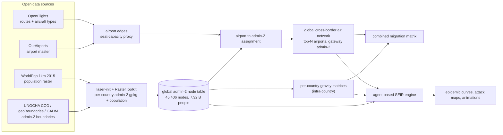

Everything targets **vintage 2015** (population and boundaries) and uses only open data.

---

## 2. Data collection

### 2.1 Administrative boundaries (admin-2)

The scope is the **193 UN member states**. We want the second administrative level (ADM2 —
districts/counties) everywhere, but no single open source has clean ADM2 for all 193, so we
acquire each country through a **source waterfall** (driven by the `laser-init` tool), taking
the first source that yields features and falling back a level where ADM2 does not exist:

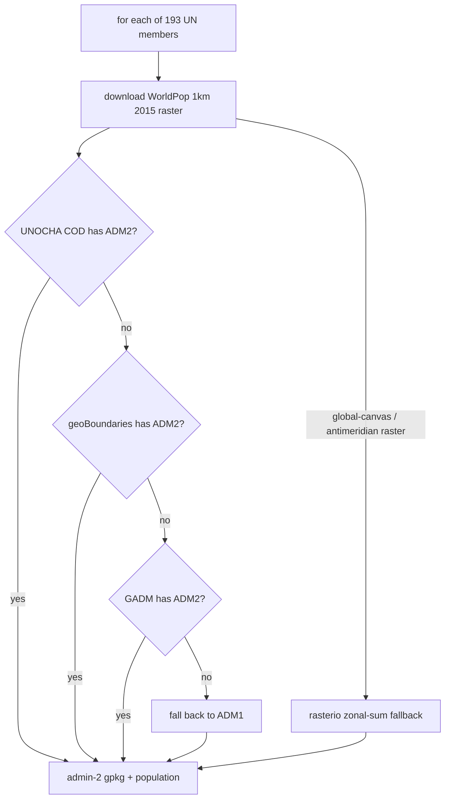

| Source | Role | License |
|---|---|---|
| **UNOCHA COD-AB** | preferred where ADM2 exists (authoritative national data) | per-country |
| **geoBoundaries gbOpen v6** | global fill (covers ~180 of 193 at ADM2) | CC-BY 4.0 |
| **GADM 4.1** | last-resort fallback | non-commercial |

The realized split: **~105 countries via UNOCHA COD, ~84 via geoBoundaries**, **174 at ADM2
and 14 at ADM1** (microstates with no ADM2 anywhere). All output is harmonized to EPSG:4326.
Provenance for every download is recorded by `laser-init`, and our per-country outcome
(source, level, unit count, population) is logged to `output/nodes/acquisition_manifest.csv`.

### 2.2 Population rasters

Population comes from **WorldPop Global 2015–2030 (R2025A), constrained, UN-adjusted, 1 km**
(`{iso}_pop_2015_CN_1km_R2025A_UA_v1.tif`), one raster per country, in persons-per-pixel on
a WGS84 grid. Population is aggregated to each admin-2 polygon by **RasterToolkit** — a
point-in-polygon zonal sum of the raster cells inside each polygon.

Two robustness wrinkles were handled:

- **Global-canvas / antimeridian rasters.** A handful of countries (Russia, Fiji, Kiribati,
  Tuvalu, and a packaging quirk for Eritrea) ship their raster on a full global grid with a
  tie point of exactly `x0 = -180`, which trips RasterToolkit's strict bounds assertion. For
  these we fall back to a **rasterio** zonal sum (`wwsim.zonal`) that reads only each
  polygon's window — correct, and cheap even on a global raster.
- **Empty product.** Kiribati's R2025A file is an empty canvas; we fall back to the older
  WorldPop 2000–2020 1km UN-adjusted product for it.

The result is **45,406 admin-2 nodes across 193 countries totalling 7.32 billion people** —
about 99.5% of the 2015 world population.

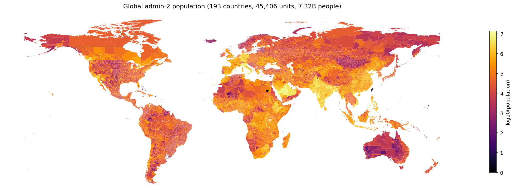

*Per-admin-2 population (log scale). Every UN member is present at admin-2, except 14
microstates represented at admin-1.*

The admin-2 granularity varies widely by country — from a handful of units in microstates to
thousands in large federal states:

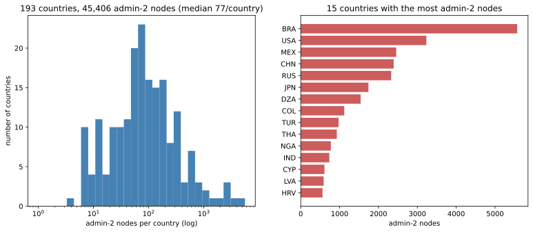

### 2.3 Air travel

The between-country coupling needs origin–destination air links. The commercial standard
(OAG passenger O-D volumes) has **no free equivalent**, so we substitute two open datasets
and a transparent proxy:

- **OurAirports** (`airports.csv`, public domain): the airport master — coordinates, ISO
  country, IATA/ICAO codes. **9,056 airports** with an IATA code and coordinates.
- **OpenFlights** (`routes.dat`, ODbL, ~2014 vintage): **67,663 carrier-level routes**, each
  with an `equipment` list of aircraft type codes.

Because routes carry no seats or frequency, we weight each carrier-route by a
**seat-capacity proxy**: a curated aircraft-type → typical-seats table (covering **97.6%** of
the equipment codes that appear in the data). Summing seat capacity across all carrier-routes
on a directed airport pair gives a relative "seats offered" volume — our passenger-volume
proxy. Codeshares are excluded (to avoid double-counting one physical flight) and only
non-stop legs are kept. This yields **33,672 directed airport edges, of which 18,129 are
cross-border.**

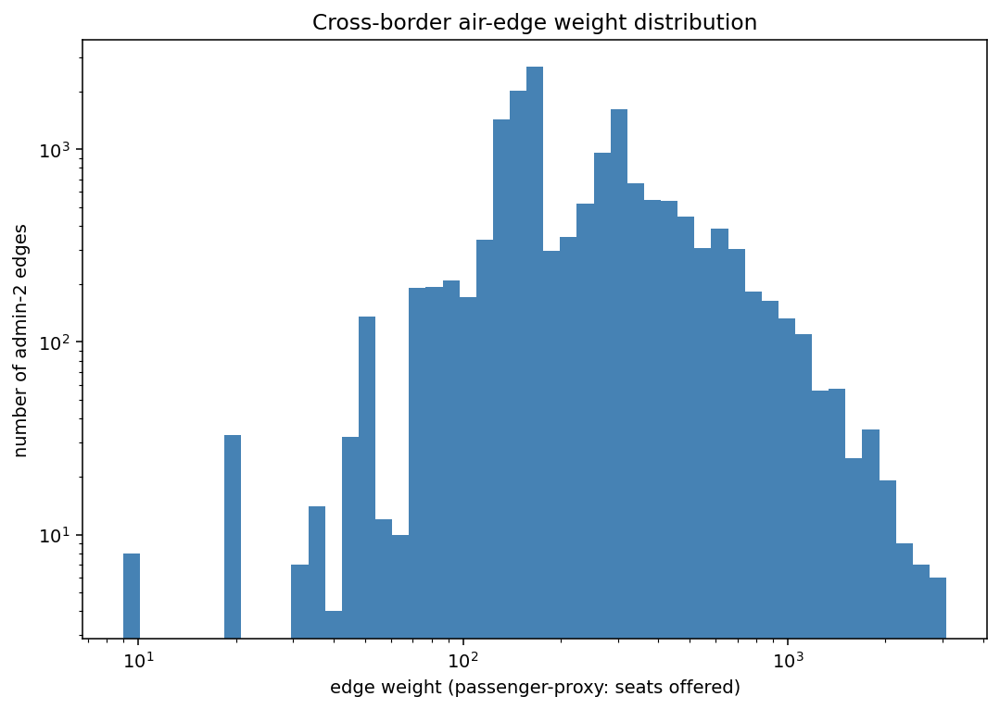

*The seat-capacity proxy is heavy-tailed: a few trunk routes dominate, most are thin.*

The proxy is honest about what it is — relative connectivity, not measured passengers. The
schema is designed so a licensed OAG O-D table can replace the weights with zero downstream
change (`wwsim.oag`).

---

## 3. Processing pipeline

### 3.1 The global node table

The per-country GeoPackages carry source-specific columns (UNOCHA `adm2_pcode`, geoBoundaries
`shapeID`, GADM `GID_2`). We normalize them to one schema and stack them into a single
worldwide table where every admin-2 unit gets a stable integer `global_nodeid` (0…N-1):

```
global_nodeid | iso3 | adm2_name | adm2_id | adm1_name | population | lon | lat | geometry
```

`global_nodeid` is **the index for everything downstream** — every network matrix is indexed
by it, so the node table and all matrices share one coordinate system of nodes. Centroids
(`lon`,`lat`) are used for gravity distances; the polygons are used for airport assignment
and mapping.

### 3.2 Airport → admin-2 assignment

The air network connects admin-2 *nodes*, not airports, so each airport is mapped to the
admin-2 polygon that contains it (a point-in-polygon spatial join against the global node
table). Two refinements:

- **Border disambiguation.** Different sources' polygons can overlap slightly at borders, so
  a point may fall in more than one node; we keep the node whose country matches the
  airport's own ISO country.
- **Nearest fallback.** Airports just offshore or on reclaimed land may not fall inside any
  polygon; we snap them to the nearest node *in their own country* within a distance cap.

Outcome: **8,836 / 9,056 airports assigned** (8,666 by containment, 170 by nearest); the 220
unassigned are mostly in dependencies/territories outside the 193 members.

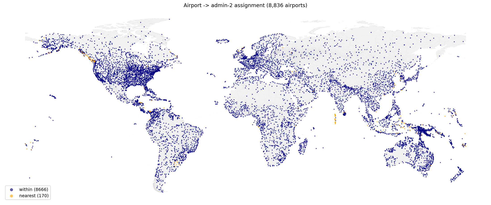

*Airports colored by assignment method (containment vs nearest-node fallback).*

### 3.3 The two coupling networks

Both networks are sparse matrices over the global node index. Each is **row-normalized to a
fixed out-fraction**: every node with out-edges exports that fraction of its force of
infection, split among destinations by the raw (gravity or seat) weights.

**Intra-country gravity.** For each country we build a dense gravity matrix over its admin-2
nodes,

```
w_ij = k · P_i^a · P_j^b / D_ij^c        (i ≠ j; diagonal = 0)
```

with `P` the admin-2 population and `D_ij` the great-circle distance between centroids
(defaults `k=500, a=b=1, c=2`). These per-country blocks are placed **block-diagonally** over
the global index — i.e. gravity couples nodes only *within* a country. Across all 193
countries this is **72.8 million intra-country edges**.

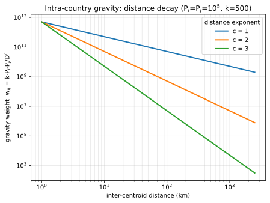

*The distance-decay exponent `c` controls how local the diffusion is; `c=2` (default) is a
classic inverse-square gravity kernel.*

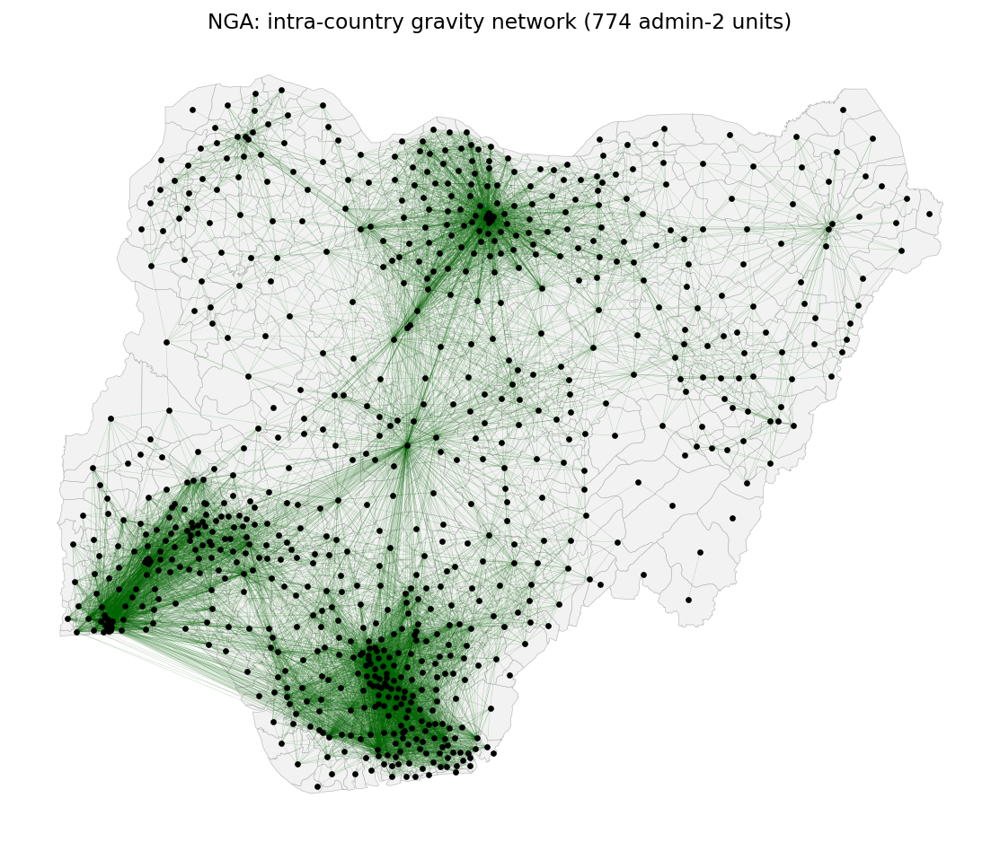

*The strongest intra-country gravity edges for one country (Nigeria) — high-population
admin-2 units mutually couple most strongly, with decay over distance.*

**Inter-country air.** From the airport edges we (1) keep only the **top-N airports by
passenger-volume proxy**, (2) map each airport to its admin-2 node, (3) keep only
**cross-border** edges, and (4) **aggregate all airports in the same admin-2 unit** into one
node. For the default top-1000 this yields **15,221 directed admin-2 → admin-2 edges across
738 gateway nodes**. Only those gateway admin-2 units (the ones containing a selected
airport) participate in the international coupling.

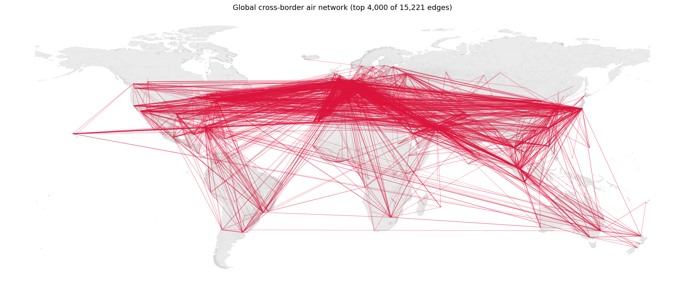

*The global cross-border air network over admin-2 nodes (heaviest edges shown).*

**Combined.** The two layers sum into one global migration matrix — gravity on the diagonal
blocks, air off the blocks — through a pluggable multi-modal combiner (`ModeNetwork`) that
also accepts future rail edges. The combined matrix is `45,406 × 45,406` with ~72.8 M
non-zeros.

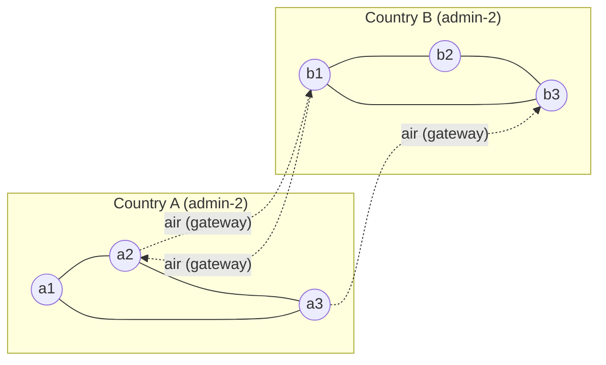

*Solid edges: dense within-country gravity. Dashed edges: sparse cross-border air, only
between admin-2 units that contain a top-N airport.*

---

## 4. The agent-based SEIR model

### 4.1 Why agents

LASER's design goal is to run **large-population agent-based models on commonly available
hardware**. We follow that: each (subsampled) person is an individual agent, not a
compartment count. Agent resolution buys correct discrete stochasticity (extinction, founder
effects, integer seeding) and a clean path to per-agent heterogeneity later — at the cost of
needing to be ruthless about per-agent memory.

### 4.2 The 4-byte agent

Each agent carries exactly three properties, in a structure-of-arrays `LaserFrame`:

| property | dtype | bytes | meaning |
|---|---|---|---|
| `state` | `uint8` | 1 | S=0, E=1, I=2, R=3 |
| `nodeid` | `uint16` | 2 | admin-2 node (0…45,405 < 65,536) |
| `timer` | `uint8` | 1 | countdown, **reused** for incubation → infectious → waning |

**4 bytes per agent.** A single `uint8` timer is reused across the timed states (a residency
in any state lasts ≤ 255 days), rather than separate `etimer`/`itimer`/`rtimer` columns. At
full resolution the world is ~7.32 B agents ≈ **29 GB** — fits in a 32 GB+ machine — and a
`subsample` divisor scales it down for routine work (subsample 2 ≈ 14.6 GB; subsample 20 ≈
1.5 GB).

Node-level compartment counts are stored separately as `(nticks+1, n_nodes)` int32 arrays
(`nodes.S/E/I/R`), carried forward each tick and updated by the per-node transition deltas
the kernels accumulate — so there is **no per-tick re-census** of 100s of millions of agents.

### 4.3 Making it fit on a laptop

Several deliberate choices keep a billions-of-agents, 45k-node model within laptop RAM:

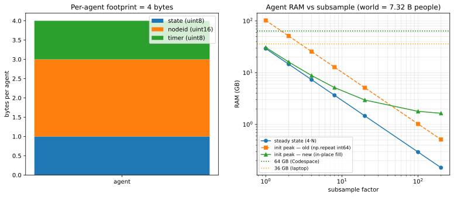

- **Parsimonious dtypes + single reused timer** → 4 bytes/agent (left panel).
- **Subsampling** scales the agent population linearly (right panel).
- **Sparse coupling, not dense.** laser-generic's stock transmission couples nodes with a
  dense `ft[:,None] * network` operation. At 45,406 nodes that matrix is ~8 GB and ~2 billion
  multiplies *per tick* — infeasible. We replace it with sparse matrix-vector products (see
  §4.6), reducing the per-tick coupling to ~72 M operations.
- **No dense distance/gravity matrix.** The stock model also builds a dense 45,406² distance
  and gravity matrix (~8 GB each). We never materialize those: gravity is built per country
  (small dense blocks) and assembled directly into one sparse matrix.
- **In-place node-id initialization.** Filling `nodeid` with
  `np.repeat(np.arange(n_nodes, int64), pops)` builds a `num_agents`-length **int64**
  temporary — ~29 GB at subsample 2, a ~3× peak-RAM spike at init that OOM-kills in a
  container with a hard memory limit (macOS hides it via memory compression + swap). We fill
  the preallocated `uint16` column block-by-block instead, with no large temporary — dropping
  the init peak from ~50 GB to ~16 GB (right panel, dashed vs solid).
- **Constant per-node denominator.** Agents never migrate between nodes (the network couples
  *infection pressure*, not people), so each node's total population `N` is constant — no
  bookkeeping, no divide-by-recount.

### 4.4 State machine and per-tick ordering

The disease progression is a standard SEIR (with an optional SEIRS waning path), driven by
the single reused timer:

```mermaid
stateDiagram-v2
  [*] --> S
  S --> E: infected (FOI); timer = incubation
  E --> I: timer hits 0; timer = infectious
  I --> R: timer hits 0; (timer = waning if SEIRS)
  R --> S: timer hits 0 (SEIRS only)
```

Each tick runs three steps, in this order:

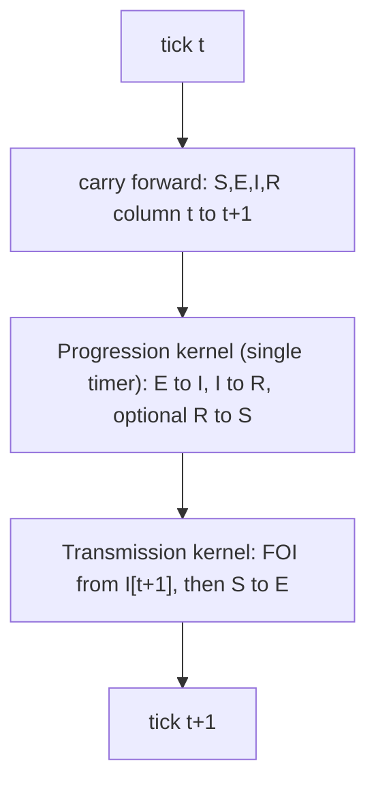

Running **progression before transmission** is deliberate (the "razer ordering"): an agent
infected this tick gets its incubation timer set *after* progression has already advanced
the existing E/I agents, so it is not decremented in the same tick. Combined with the
progression kernel **branching on each agent's entry state** (so an E→I transition is not
also processed as an I that tick), every state realizes its full duration. The result is an
exact `R0 = beta · infectious_period` with no off-by-one residency artifact — confirmed in
§6.

### 4.5 The Numba kernels

The two hot loops are JIT-compiled with Numba and run in parallel across agents
(`prange`), releasing the GIL. Per-node transition counts are accumulated into a
`(threads, nodes)` scratch array and summed at the end — a standard race-free reduction.

**Progression** — one pass over all agents, branching on the entry state, reusing the timer:

```python
@nb.njit(nogil=True, parallel=True, cache=True)
def nb_progress(state, timer, nodeid, inf_dur, wan_dur, has_waning,
                to_infectious, to_recovered, to_susceptible):
    for i in nb.prange(len(state)):
        s = state[i]; tid = nb.get_thread_id(); nid = nodeid[i]
        if s == EXPOSED:
            timer[i] -= 1
            if timer[i] == 0:
                state[i] = INFECTIOUS; timer[i] = inf_dur
                to_infectious[tid, nid] += 1
        elif s == INFECTIOUS:
            timer[i] -= 1
            if timer[i] == 0:
                state[i] = RECOVERED
                timer[i] = wan_dur if has_waning else 0
                to_recovered[tid, nid] += 1
        elif has_waning and s == RECOVERED:
            timer[i] -= 1
            if timer[i] == 0:
                state[i] = SUSCEPTIBLE
                to_susceptible[tid, nid] += 1
```

**Infection** — the per-node infection probability `prob[node]` is computed by the FOI step
(§4.6); the kernel only draws and flips susceptibles to exposed:

```python
@nb.njit(nogil=True, parallel=True, cache=True)
def nb_infect(state, nodeid, prob, inc_dur, timer, newly_infected):
    for i in nb.prange(len(state)):
        if state[i] == SUSCEPTIBLE:
            nid = nodeid[i]
            if np.random.random() < prob[nid]:
                state[i] = EXPOSED; timer[i] = inc_dur
                newly_infected[nb.get_thread_id(), nid] += 1
```

These are the only two passes over the agent array each tick; everything else operates on the
small node-level vectors.

### 4.6 The custom force of infection

This is the heart of the model and the one place the epidemiology lives. The per-node force
of infection starts from the local mass-action term and then couples nodes through the sparse
networks:

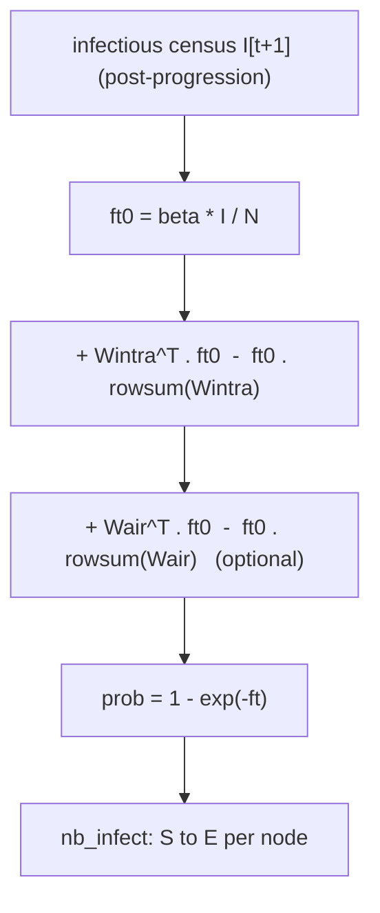

In code (`wwsim.abm.components.Transmission.step`):

```python
infectious = nodes.I[tick + 1].astype(np.float64)     # settled, post-progression
ft0 = beta * infectious / node_pop                    # local mass action
ft  = ft0 + intra_WT.dot(ft0) - ft0 * intra_rowsum    # within-country coupling (sparse)
if air_WT is not None:
    ft = ft + air_WT.dot(ft0) - ft0 * air_rowsum      # cross-border coupling (sparse)
prob = -np.expm1(-ft)                                  # 1 - exp(-ft)
```

The coupling term reproduces laser-generic's dense `ft + Wᵀ·ft − ft·rowsum` (a node exports a
fraction of its FOI to its neighbours and receives theirs) but using **pre-transposed sparse
matrices**, so the cost is O(non-zeros) ≈ 72 M, not O(N²) ≈ 2 B. Reading the **post-progression**
infectious census `I[t+1]` is what makes newly-infectious agents count from their entry tick
and recoveries drop out on their recovery tick — the basis of the exact `beta·D`.

The FOI also admits an **optional per-country, per-tick transmissibility multiplier**
`m_c(t)` (`ft0 = beta · m_country(node)(t) · I/N`), applied uniformly to all admin-2 nodes of
a country — a hook for time-varying forcing. It is off by default; the model runs with a
constant `beta` unless a forcing is supplied.

---

## 5. Intra- vs inter-country transmission

The two networks play complementary roles, and the model makes the distinction vivid. With
**only** the intra-country gravity coupling, an epidemic seeded in one country **stays in that
country** — gravity diffuses it across the seed country's admin-2 units but has no path
across borders. Adding the air network injects **long-range cross-border jumps** between
gateway admin-2 units, which then ignite local gravity diffusion in each newly-seeded country.

The same scenario (seeded in Shanghai, β=0.35) makes this concrete:

| coupling | horizon | final attack | interpretation |
|---|---|---|---|
| gravity only | 180 d | **14.4%** | confined to the seed country (≈ China's share of world pop) |
| gravity + air | 180 d | **28.6%** | borders crossed via gateways; multiple countries seeded |
| gravity + air | 540 d | **84.5%** | global sweep toward the herd-immunity threshold |

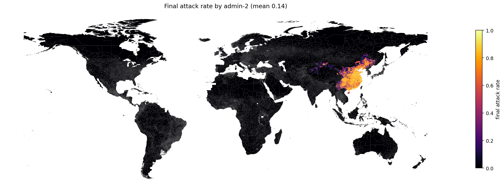

*Gravity only (180 days): the epidemic is trapped in the seed country.*

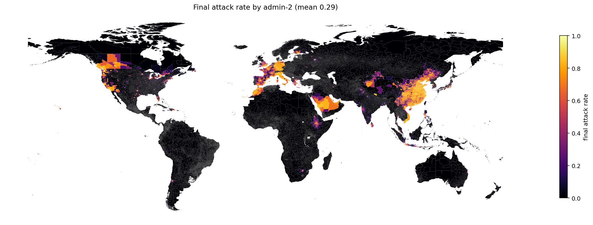

*Gravity + air (180 days): the epidemic has jumped to the major air-hub countries (Western
Europe, the US, the Gulf, South Africa, SE Asia, Australia) and is diffusing locally around
each gateway.*

Over a long horizon the combined model produces a single global wave:

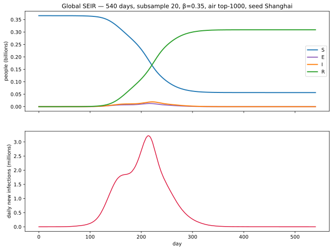

A still frame from the per-node infectious-prevalence animation (day 200, near the global
peak) shows the spatial structure — the wave brightening around gateways and diffusing
outward, the seed country already receding:

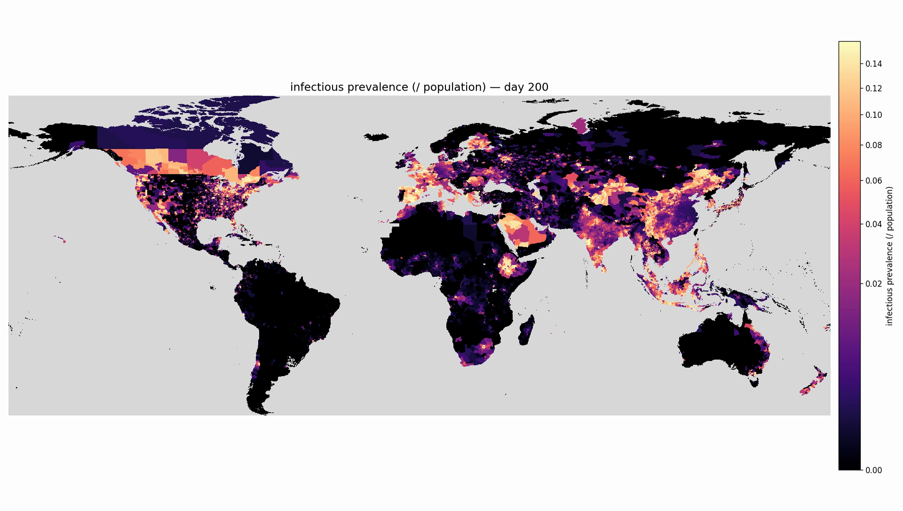

▶ **Full animation:** [`media/anim_world540_air_I.mp4`](media/anim_world540_air_I.mp4) — 540
days of infectious prevalence (one frame per day), seeded in Shanghai, gravity + air. On
GitHub the file page plays the video inline.

Mechanistically: gravity is the **short-range diffusion** operator (block-diagonal, dense
within a country, decaying with distance); air is the **long-range jump** operator
(off-diagonal, sparse, gateway-to-gateway, cross-border only). The combined dynamics —
local diffusion punctuated by long jumps — is exactly the structure one wants for global
spatial spread, and each layer can be scaled independently to tune the balance.

---

## 6. Validation and tests

**Epidemiological validation.** In a single well-mixed node (network nullified), the model
must reproduce the Kermack–McKendrick final size for `R0 = β · infectious_period`. It does:

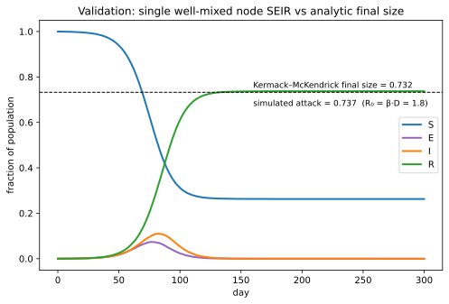

*Simulated attack fraction 0.737 vs the analytic final size 0.732 for R0 = 1.8; the small
excess is the expected discrete-daily stochastic overshoot. Population is conserved exactly.*

**Test suite.** The project carries **42 given-when-then tests** (`pytest`), each documenting
the scenario it constructs and the failure it guards against:

| area | what is checked |
|---|---|
| `test_countries` | exactly 193 distinct valid ISO3; observers/non-members excluded |
| `test_config` | defaults and YAML overlay merge |
| `test_gravity` | haversine distances (~111 km/deg), gravity symmetry & distance-decay, row-normalization, edge-list extraction |
| `test_flights` | `\N` parsing, seat proxy, codeshare/direct filters, per-pair aggregation, airport volume |
| `test_airports_assign` | containment, nearest fallback, border disambiguation |
| `test_air_network` | cross-border-only, top-N filter, per-admin-2 aggregation, sparse matrix placement |
| `test_network` | multi-modal combiner sums layers with scale; empty handling |
| `test_nodes` | schema harmonization across UNOCHA/geoBoundaries gpkgs; mojibake repair |
| `test_rail_oag` | rail/OAG adapters ingest into the canonical schemas |
| `test_abm` | population conservation; single-timer E→I→R timing; gravity coupling spreads / no-coupling isolates; **Kermack–McKendrick final size**; forcing unity/zero/scaling |

The ABM tests pin the engine's correctness specifically: that people are conserved every
tick, that the single reused timer produces the right state timing, that the sparse coupling
spreads infection along edges and *only* along edges, and that the FOI reproduces the analytic
attack fraction.

---

## 7. Performance

On a laptop-class machine the engine is fast because the only billion-scale work is the two
parallel Numba passes; everything else is small-vector or sparse:

- **540-day run, 45,406 nodes, 365.8 M agents (subsample 20), gravity + air:** ~**2 minutes**
  wall-clock for the simulation loop.
- Per-tick cost is dominated by the two agent passes (parallel over cores) plus a ~72 M-nnz
  sparse mat-vec; node-level bookkeeping is negligible.
- Memory at this scale is ~1.5 GB for agents plus ~1–2 GB for the sparse intra network.

Full resolution (subsample 1, ~7.3 B agents) is feasible on a 32 GB+ machine after the
in-place node-id fix (§4.3).

---

## 8. Reproducibility and extensibility

**Layout.** Acquired data lives under `data/` (and the `laser-init` cache in `~/.laser`);
derived artifacts under `output/` (the node table, per-country gravity matrices, the air and
combined networks, plots, and SEIR runs). The pipeline is a numbered sequence of scripts
(`scripts/01…08` for data → networks, `10` to run the SEIR model, `12` to animate); each is
resumable and reads/writes the on-disk layout from `wwsim.config`.

**Extensibility.**

- **Rail** plugs in as another `ModeNetwork` (`wwsim.rail`) — a station-coordinate or node-id
  edge CSV is snapped to admin-2 and summed into the inter-nation coupling.
- **Licensed OAG** O-D data drops into `wwsim.oag` and replaces the open seat proxy with zero
  downstream change.
- **Time-varying transmissibility** is supported via the optional per-country FOI multiplier
  (§4.6).
- The **top-N airport cut-off** is a single knob (`--top-n`) that re-derives the air and
  combined networks without touching the node table or gravity matrices.

The whole stack is open-data and open-source end to end: from boundary shapefiles and a
population raster to a runnable, validated, planet-scale agent-based SEIR model that fits on a
laptop.
